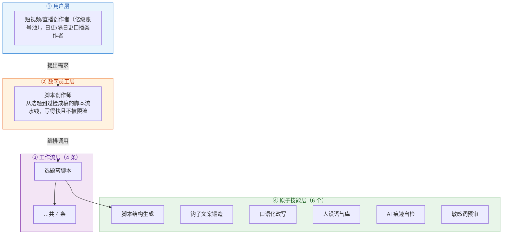
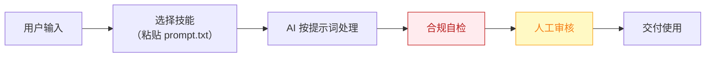

# 脚本创作师 — 业务架构

## 四层视图

## 资产形态说明

本资产包为**纯提示词客户端资产**：

| 特性 | 说明 |
|------|------|
| 无运行时依赖 | 不调用任何模型 API，不需要 API Key |
| 平台无关 | 提示词为纯文本，可导入任意主流 AI 平台 |
| 用户自备算力 | 模型由用户自己的订阅提供 |
| 零服务端成本 | 资产方不产生任何调用费用 |

## 数据流

> **关键设计**：所有对外输出必须经过「合规自检 → 人工审核」双闸门。

## 能力边界

| 维度 | 内容 |
|------|------|
| **目标用户** | 短视频/直播创作者（亿级账号池），日更/隔日更口播类作者 |
| **做** | 选题转脚本、口播改写、分镜清单、AI 痕迹自检与降 AI 味 |
| **不做** | 不做：拍摄剪辑（物理环节）、真人出镜替代、不生成违规/夸大宣传内容 |
| **KPI** | 单脚本产出时长 ≤15 分钟（原 3-6h 创作环节中的写作段）；AI 检测通过率 ≥90%；成片采用率 ≥60% |
| **定价** | ¥30-80/月（据 R2 调研） |

---

*本图由 build_p0_assets.py 自动生成*
