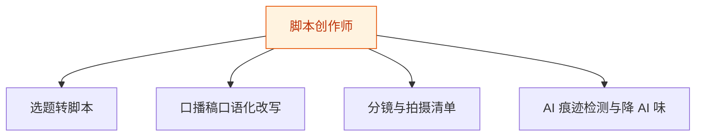
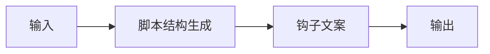
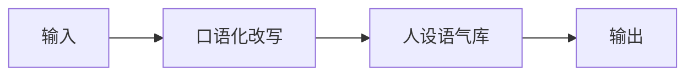
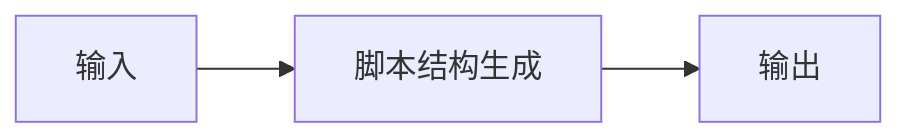
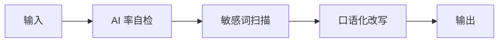

# 脚本创作师 — 工作流流程图

本员工共 **4 条工作流**，下辖 **6 个原子技能**。

## 总览

## 分条详情

### 选题转脚本

| 项目 | 内容 |
|------|------|
| 触发 | 人工（选题确认后） |
| 复杂度 | `S` |
| 阶段 | `P0` |
| ROI | 写作段 2-4h→15min，按日更计月省约 60h×¥30≈¥1800 vs ¥30-80 |

### 口播稿口语化改写

| 项目 | 内容 |
|------|------|
| 触发 | 事件（WF1 后自动） |
| 复杂度 | `S` |
| 阶段 | `P0` |
| ROI | 含于 WF1 工时内，核心是人设一致性带来的返工归零 |

### 分镜与拍摄清单

| 项目 | 内容 |
|------|------|
| 触发 | 人工（按需） |
| 复杂度 | `S` |
| 阶段 | `P1` |
| ROI | 拍摄准备 0.5-1h→10min，月省约 8h≈¥240 |

### AI 痕迹检测与降 AI 味

| 项目 | 内容 |
|------|------|
| 触发 | 事件（交付前强制闸门） |
| 复杂度 | `M` |
| 阶段 | `P0` |
| ROI | 规避限流的"存亡价值"：一次限流损失远超订阅费（据 R2 调研痛点 #3） |

## 汇总表

| # | 工作流 | 阶段 | 复杂度 | 触发 | 涉及技能数 |
|---|--------|------|--------|------|-----------|
| 1 | 选题转脚本 | `P0` | `S` | 人工（选题确认后） | 2 |
| 2 | 口播稿口语化改写 | `P0` | `S` | 事件（WF1 后自动） | 2 |
| 3 | 分镜与拍摄清单 | `P1` | `S` | 人工（按需） | 1 |
| 4 | AI 痕迹检测与降 AI 味 | `P0` | `M` | 事件（交付前强制闸门） | 3 |

---

*本图由 build_p0_assets.py 自动生成*
