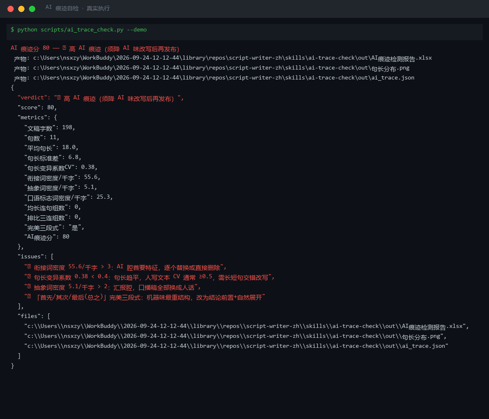
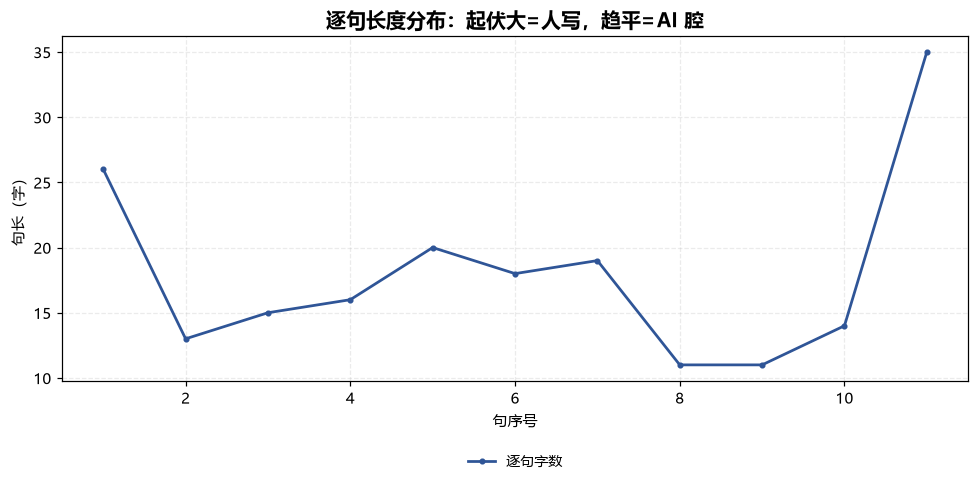
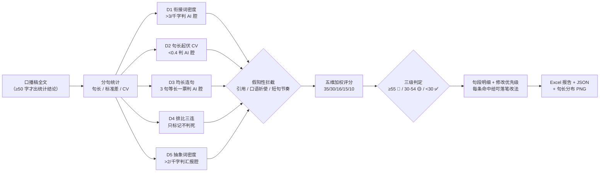

# AI 痕迹自检 AI Trace Check

> 原子技能 ｜ 属于「脚本创作师」 ｜ 自媒体创作者客群 ｜ T1 产物型（脚本交付真实文件）
>
> **发布前把稿子里的「AI 腔」逐句挑出来，按严重度排序，给出能直接落笔的改写方向。**
> 五维量化检测（衔接词密度 / 句长起伏 CV / 均长连句 / 排比三连 / 抽象词密度）+ 2 项结构级检测 · 三级判定阈值 · 假阳性拦截 · 一次运行输出 Excel 报告 + 句长分布图



*上图来自真实执行：198 字演示稿 AI 痕迹分 80（🔴 高 AI 痕迹），CV 0.38、衔接词密度 55.6 个/千字，11 句中 10 句命中，产物落盘 Excel + PNG + JSON。*

---

## 它测什么（五维 + 结构级，全部量化）

### 五维文本统计检测

| 维度 | 判定规则 | 权重 | 改写方向 |
|---|---|---|---|
| D1 衔接词密度 | 「首先/其次/值得注意的是/综上所述…」密度 >3 个/千字判 AI 腔；1-3 警告；目标 <1 | 35 | 大多**直接删除**，加语气词衔接（「那问题来了」） |
| D2 句长起伏 CV | CV = 句长标准差 ÷ 平均句长；≥0.5 人味正常；<0.4 判 AI 腔 | 30 | 平均句长压到 8-14 字，每 3-5 长句插一个 ≤6 字「呼吸口」 |
| D3 均长连句 | 连续 3 句两两相差 ≤2 字且均 >18 字 → 一票判 AI 腔 | 16 | 三句必拆一：删成短句 / 合并成长句 / 加插入语 |
| D4 排比三连 | 连续 ≥3 句前两字相同 → 只标记不判死 | — | 有意口播排比保留 ≤1 组，多余换写法 |
| D5 抽象高频词 | 「赋能/抓手/闭环/底层逻辑…」密度 >2 个/千字判汇报腔 | 15 | 全部换人话：「赋能创作者」→「帮创作者赚钱」 |

### 结构级附加检测

1. **完美三段式**：「首先…其次…最后/总之」齐活 → 机器味最重的结构，改「结论前置 + 自然展开」（权重 10）
2. **口语标志词缺失**：「我/你/咱们/家人们/说实话」密度 <5 个/千字 → 加第二人称与互动句

### 综合判定（三级）

| AI 痕迹分 | 判定 | 动作 |
|---|---|---|
| ≥ 55 | 🔴 高 AI 痕迹 | 须降 AI 味改写后复检，不建议直接发布 |
| 30-54 | 🟡 中度 | 按句段明细改写命中处，改完复检 |
| < 30 | ✅ 人味正常 | 进入发布流程 |

**假阳性拦截**：引用他人原话/弹幕中的衔接词不计入；「注意」「别急」是互动手段不是 AI 腔；口播 3-5 字短句连发是节奏不是趋平；稿件 <50 字不出统计结论；排比仅标记不判死。

## 真实输入 → 真实输出

**输入**（`examples/input.json`，198 字典型 AI 腔稿件，节选）：

> 在当今数字化时代，掌握副业技能已经成为许多人的迫切需求。首先，我们需要明确副业的定位。其次，我们需要评估自己的时间分配。此外，我们还需要考虑技能的变现路径。值得注意的是……综上所述……总而言之，只要坚持执行计划，副业收入就能稳步提升，最终实现个人价值的全面提升。

**输出**（脚本实跑，AI 痕迹分 80，句段明细节选）：

| # | 句长 | 原句 | 痕迹标记 | 判定 |
|---|---|---|---|---|
| 1 | 26 | 在当今数字化时代，掌握副业技能已经成为许多人的迫切需求 | 衔接词:在当今 | 🔴 |
| 5 | 20 | 值得注意的是，副业的选择必须与主业形成互补 | 衔接词:值得注意的是 | 🔴 |
| 7 | 19 | 综上所述，副业的发展需要一个系统性的规划 | 衔接词:综上所述 | 🔴 |
| 11 | 35 | 总而言之，只要坚持执行计划，副业收入就能稳步提升…… | 衔接词:总而言之 · 长句35字 | 🔴 |

完整 11 句明细与修改优先级见 [`examples/output.md`](examples/output.md)。

**产物**（out/ 实跑落盘）：

| 文件 | 说明 |
|---|---|
| `out/AI痕迹检测报告.xlsx` | 五维汇总 / 句段明细（🔴 标红）/ 衔接词命中 / 抽象词命中 4 sheet |
| `out/句长分布.png` | 逐句长度折线，11 句集中在 8-19 字的「趋平」形态一目了然 |
| `out/ai_trace.json` | 机器可读结果（verdict / score / metrics / sentences / issues） |



*实跑产物：句长趋平（CV 0.38 < 0.4）是 AI 腔最强的统计指纹之一。*

## 处理流水线



## 快速开始

**方式一：提示词（任意 AI 工具）**

```text
1. 打开 prompt.txt，全文复制
2. 粘贴到 Coze / WorkBuddy / Dify / Claude / ChatGPT
3. 按 schema.json 的输入规格提供：待检口播稿全文
```

**方式二：脚本（零 AI 依赖，确定性统计）**

```bash
# 演示模式（内置 AI 腔样例）
python scripts/ai_trace_check.py --demo
# 指定输入
python scripts/ai_trace_check.py --input examples/input.json --outdir out
# 直接传文本
python scripts/ai_trace_check.py --text "你的稿件内容"
```

依赖：仅 Python 标准库。**数值以脚本输出为准，不要自己算**——句长、CV、密度全是统计量，肉眼估不准。

## 面向谁 / 什么时候用

| ✅ 该用 | ❌ 别用 |
|---|---|
| 口播稿/图文稿发布前的最后一道 AI 味检查 | 替代平台官方「AI 检测器」（两者口径不同） |
| 降 AI 味改写前先定位命中句段，避免整篇重写 | 证明文本「是不是 AI 写的」（本方法只能给参考分） |
| 批量稿件交付前的快速筛查（脚本模式） | 稿件 <50 字硬要结论（脚本会要求补稿） |
| 团队统一「AI 腔」验收口径（阈值可量化） | 涉及资金/签约/医疗等决策场景 |

## 边界与合规

- 本资产输出为 **AI 辅助生成内容**，交付前必须人工审核，并按平台要求完成 AI 内容标识
- 本检测是**启发式统计方法，不能证明**文本是否由 AI 生成，只能给出「像不像人写的」参考
- 检测结果供作者自查，**不做平台判定的依据承诺**；对外发布保留人工确认环节
- 不抓取需登录的私域数据；连接器只走官方 API 与用户自行导出数据

## 文件地图

```text
├── README.md                      ← 本文件
├── SKILL.md                       ← 资产定义（元信息 / 契约 / 边界）
├── prompt.txt                     ← 提示词本体（五维规则 + 假阳性拦截 + 输出格式）
├── schema.json                    ← 输入输出契约（机器可读）
├── scripts/ai_trace_check.py      ← 确定性检测脚本（五维统计 → Excel/JSON/PNG）
├── examples/                      ← 真实输入 + 脚本实跑输出
├── docs/                          ← 9 项配套文档（架构 / 流程 / 场景 / 测试报告…）
└── out/                           ← 实跑产物（AI痕迹检测报告.xlsx / 句长分布.png / ai_trace.json）
```

---

*本资产遵循 [bangwozuo 数字员工资产规范](https://github.com/bangwozuo/digital-employee-spec) v3.0 ｜ [所属员工：脚本创作师](../../) ｜ [总入口](https://github.com/bangwozuo/digital-employees-hub-zh)*
