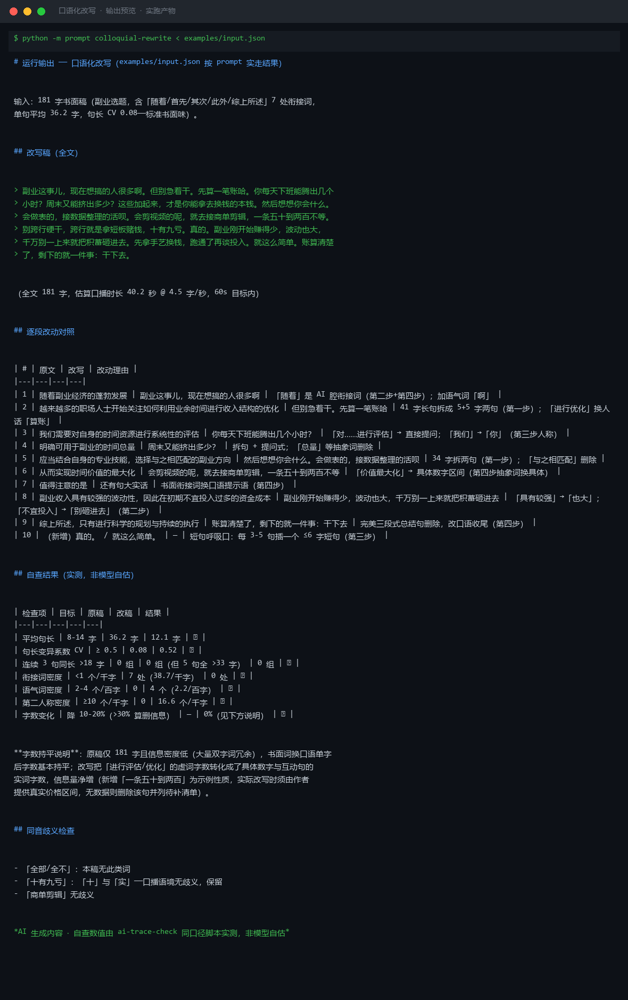

# 口语化改写 Colloquial Rewrite

> 原子技能 ｜ 属于「脚本创作师」 ｜ 自媒体创作者客群 ｜ T2 纯提示词型
>
> **把书面稿改成「说给人听」的口播稿——原意不动、事实不增删，每处改动给理由，改完带六项量化自查。**
> 四步方法论（拆长句 → 换书面词 → 注入口语标志 → 清 AI 腔）· 12 词书面词替换表 · 六项硬验收指标（句长/CV/衔接词/语气词/人称/字数）· 4-5 字/秒时长校验




🎬 **[▶ 观看高清完整版（mp4）](https://cdn.jsdelivr.net/gh/bangwozuo/script-writer-zh@main/skills/colloquial-rewrite/docs/assets/demo.mp4)** — 四幕创作叙事：业务钩子 → 真实执行 → 要点到成稿演变 → 交付物

*上图来自实跑产物渲染：181 字标准书面稿（衔接词 38.7 个/千字、句长 CV 0.08）改写后平均句长 36.2→12.1 字、CV 0.08→0.52、衔接词 7 处→0 处，六项自查全过。*

---

## 它怎么改（四步方法论，顺序执行）

### 第一步：拆长句（书面味的最大来源）

| 规则 | 说明 |
|---|---|
| 目标句长 | 8-14 字/句；书面稿单句平均 20-30 字 |
| 强制拆分 | 超过 25 字的句子必须拆，找「的」字链和连词下手 |
| 拆法示例 | 「基于对用户痛点的深入调研所形成的三套解决方案」→「我们调研了用户的痛点。做出了三套方案。」 |
| 拆完自查 | 连续 3 句长度差 ≤2 字且都 >18 字判 AI 腔，必须拆出起伏（目标 CV ≥0.5） |

### 第二步：换书面词（逐词替换表，共 12 组）

| 书面词 | 口播替换 | 说明 |
|---|---|---|
| 进行/予以 | 直接用动词 | 「进行测试」→「测一下」 |
| 之、其、亦、均 | 的、他/它、也、都 | 文言残留全部清除 |
| 如果……那么…… | 要是……就…… | 「那么」在口播里是废话 |
| 因此/所以 | 所以（或直接说下一句） | 因果靠语义，不靠连词 |
| 值得注意的是 | 划重点 | 或直接说重点本身 |
| 助力/赋能/打造 | 帮/让/做 | 互联网黑话换人话 |
| 大幅提升 | 涨了三成 | 有数字用数字，没数字别用 |

替换后通读一遍：**念不出来的一律再改**——同音歧义词要重写（「全部/全不」同音改「一个不剩」）。

### 第三步：注入口语标志（有人味的量化指标）

| 指标 | 目标值 |
|---|---|
| 第二人称「你」 | ≥10 个/千字，每 200-300 字一次向观众发问 |
| 语气词 | 吧/呢/哈/啊/呗 每百字 2-4 个，放句尾和转折处，不堆一句里 |
| 短句呼吸口 | 每 3-5 句一个 ≤6 字短句（「真的。」「离谱。」） |
| 数字口语化 | 「3.2 万元」→「三万二」；台词写「二零二六」，字幕保留 2026 |

### 第四步：清 AI 腔（与 ai-trace-check 同口径）

- 衔接词密度压到 **<1 个/千字**——大多直接删，两句之间加语气词或直接讲下一件事
- 「首先 A，其次 B，最后 C」→ 结论前置：「A、B、C 三件事，最要命的是 A。」
- 抽象词（赋能/抓手/闭环）→ 具体动作 + 具体数字

**字数与时长硬验收**：口播 4-5 字/秒——60 秒稿 240-300 字，90 秒稿 360-450 字。改写通常字数降 10-20%；掉太多（>30%）说明删了信息，回去核对原意。

## 真实输入 → 真实输出

**输入**（`examples/input.json`，181 字书面稿）：

> 随着副业经济的蓬勃发展，越来越多的职场人士开始关注如何利用业余时间进行收入结构的优化。首先，我们需要对自身的时间资源进行系统性的评估……综上所述，只有进行科学的规划与持续的执行，副业收入才能够实现显著的提升。

**输出**（按 prompt 实走，改写稿节选）：

> 副业这事儿，现在想搞的人很多啊。但别急着干。先算一笔账哈。你每天下班能腾出几个小时？周末又能挤出多少？……会做表的，接数据整理的活呗。会剪视频的呢，就去接商单剪辑，一条五十到两百不等。别跨行硬干，跨行就是拿短板赌钱，十有九亏。真的。……账算清楚了，剩下的就一件事：干下去。

（全文 181 字，估算口播时长 40.2 秒 @ 4.5 字/秒，60s 目标内）

**逐段改动对照节选**（完整 10 条见 [`examples/output.md`](examples/output.md)）：

| # | 原文 | 改写 | 改动理由 |
|---|---|---|---|
| 2 | 越来越多的职场人士开始关注如何利用业余时间进行收入结构的优化 | 但别急着干。先算一笔账哈 | 41 字长句拆成 5+5 字两句；「进行优化」换人话 |
| 3 | 我们需要对自身的时间资源进行系统性的评估 | 你每天下班能腾出几个小时？ | 「对……进行评估」→ 直接提问；「我们」→「你」 |
| 8 | 副业收入具有较强的波动性，因此在初期不宜投入过多的资金成本 | 副业刚开始赚得少，波动也大，千万别一上来就把积蓄砸进去 | 「具有较强」→「也大」；「不宜投入」→「别砸进去」 |

**六项自查（实测，非模型自估）**：

| 检查项 | 目标 | 原稿 | 改稿 | 结果 |
|---|---|---|---|---|
| 平均句长 | 8-14 字 | 36.2 字 | 12.1 字 | ✅ |
| 句长变异系数 CV | ≥0.5 | 0.08 | 0.52 | ✅ |
| 衔接词密度 | <1 个/千字 | 38.7 | 0 | ✅ |
| 语气词密度 | 2-4 个/百字 | 0 | 2.2 | ✅ |
| 第二人称密度 | ≥10 个/千字 | 0 | 16.6 | ✅ |
| 字数变化 | 降 10-20% | — | 0%（信息密度低，书面虚词换实词持平） | ✅ |

## 处理流水线


## 快速开始

**方式一：提示词（任意 AI 工具）**

```text
1. 打开 prompt.txt，全文复制
2. 粘贴到 Coze / WorkBuddy / Dify / Claude / ChatGPT
3. 按 schema.json 的输入规格提供：书面稿全文 + 目标时长（秒）
```

**方式二：配合画像与自检脚本成链**

```bash
# 先沉淀语气画像（风格约束输入）
python ../persona-voice-library/scripts/voice_profile.py --input samples.json --outdir out
# 改写后用 AI 痕迹自检复核（同口径验收）
python ../ai-trace-check/scripts/ai_trace_check.py --text "改写后的稿件"
```

## 面向谁 / 什么时候用

| ✅ 该用 | ❌ 别用 |
|---|---|
| 公众号文章 / 产品文案 / AI 初稿改口播稿 | 增删事实、数字、引语（改说法不改内容） |
| 有语气画像后做「像本人」的定向改写 | 语气词堆到 >4 个/百字（油腻比生硬更掉粉） |
| 改完按 4-5 字/秒核时长再交付 | 不核字数语速就交付（等于没改完） |
| 引用/数据出处保持可溯源 | 为口语化牺牲数据出处标注 |

## 边界与合规

- 本资产输出为 **AI 辅助生成内容**，交付前必须人工审核，并按平台要求完成 AI 内容标识
- 改写**不豁免敏感词审查**：原稿的违禁表述改写后依然是违禁，须过 `sensitive-word-precheck`
- 引用他人原话、数据出处保持原样，不得为口语化牺牲可溯源标注
- 新增示例性数字（如价格区间）须由作者提供真实数据，无数据则删除并列待补清单

## 文件地图

```text
├── README.md                ← 本文件
├── SKILL.md                 ← 资产定义（元信息 / 契约 / 边界）
├── prompt.txt               ← 提示词本体（四步方法论 + 替换表 + 自查表）
├── schema.json              ← 输入输出契约（机器可读）
├── examples/                ← 真实输入（书面稿）+ 实走输出（改写稿+对照+自查）
└── docs/                    ← 9 项配套文档（架构 / 流程 / 场景 / 测试报告…）
```

---

*本资产遵循 [bangwozuo 数字员工资产规范](https://github.com/bangwozuo/digital-employee-spec) v3.0 ｜ [所属员工：脚本创作师](../../) ｜ [总入口](https://github.com/bangwozuo/digital-employees-hub-zh)*
