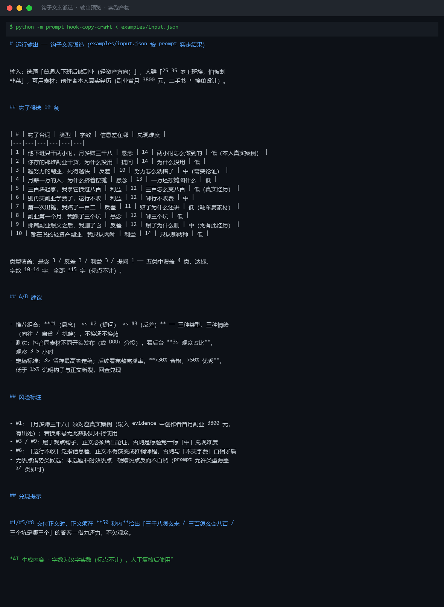
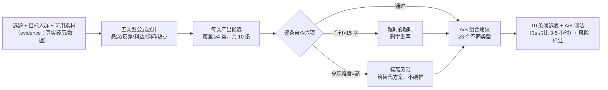

# 钩子文案锻造 Hook Copy Craft

> 原子技能 ｜ 属于「脚本创作师」 ｜ 自媒体创作者客群 ｜ T2 纯提示词型
>
> **给选题锻造黄金 3 秒开场第一句——每次 10 条候选、覆盖 ≥4 种类型、每条可直接开拍，钩子借的力正文必须还得上。**
> 钩子五类型公式 · 三条铁律（首句 ≤15 字 / 3 秒信息差 / 必须可兑现）· 六项逐条自查 · A/B 测试建议（3s 留存定稿）



🎬 **[▶ 观看演示视频（在线播放）](https://cdn.jsdelivr.net/gh/bangwozuo/script-writer-zh@main/skills/hook-copy-craft/docs/assets/demo.mp4) · [GitHub 页](https://github.com/bangwozuo/script-writer-zh/blob/main/skills/hook-copy-craft/docs/assets/demo.mp4)** — 四幕创作叙事：业务钩子 → 真实执行 → 要点到成稿演变 → 交付物

*上图来自实跑产物渲染：选题「普通人下班后做副业」10 条候选，字数 10-14 字全部 ≤15 字铁律，五类覆盖 4 类，附 A/B 组合与逐条风险标注。*

---

## 为什么钩子决定生死

前 3 秒决定约 80% 的划走行为。行业基准：**完播率 >30% 合格，>50% 优秀**；3 秒留存（抖音后台「3s 观众占比」）是钩子的直接成绩单。钩子拉胯的视频完播率通常 <15%——先死在门口。

## 钩子五类型（每次至少覆盖 4 类，每类给公式）

| 类型 | 公式 | 例 |
|---|---|---|
| 悬念型 | {反常现象} + {留白} | 「他辞职摆摊三个月，存的钱比上班一年还多。」 |
| 反差型 | {预期 A} + 但是 + {事实 B} | 「这家店装修像破产，排队排到马路牙子。」 |
| 利益型 | {具体数字/时效} + {获得感} | 「学会这招，每月水费省一半。」 |
| 提问型 | {人群} + {共同困惑}？ | 「为什么你存的干货，从来没用过？」 |
| 热点借势型 | {热点事件} + {你的角度} | 「全网都在骂的那个功能，其实藏了个彩蛋。」 |

## 三条铁律（违反任何一条 = 重写）

1. **首句 ≤15 字**（汉字实数，标点不计）——3 秒按 4.5 字/秒只念得下 13-14 字，15 字是极限
2. **3 秒内必须出现信息差**——把结论全说完的是预告不是钩子
3. **钩子必须能兑现**——正文 50 秒内给出承诺的答案，兑现不了的钩子是标题党：3 秒留存涨了，完播率和粉转黑跟着爆雷

**逐条自查六项**：字数 ≤15 / 类型标注（五类覆盖 ≥4）/ 信息差明确 / 兑现难度（低/中/高）/ 与目标人群相关 / 合规（无绝对化用语、无虚假数据、蹭热点不擦边）。

**A/B 规则**：同一选题至少备 3 个**不同类型**的钩子（换汤不换药不算 A/B），跑 3-5 小时看 3s 占比，留存高者定稿。

## 真实输入 → 真实输出

**输入**（`examples/input.json`）：

```json
{
  "topic": "普通人下班后做副业（轻资产方向）",
  "audience": "25-35 岁一二线城市上班族，主业月入 8k-15k，想增加副业收入但怕被割韭菜",
  "platform": "抖音",
  "evidence": "创作者本人真实经历：副业首月收入 3800 元；无团队无投流"
}
```

**输出**（按 prompt 实走，10 条候选节选）：

| # | 钩子台词 | 类型 | 字数 | 信息差在哪 | 兑现难度 |
|---|---|---|---|---|---|
| 1 | 他下班只干两小时，月多赚三千八 | 悬念 | 14 | 两小时怎么做到的 | 低（本人真实案例） |
| 3 | 越努力的副业，死得越快 | 反差 | 10 | 努力怎么就错了 | 中（需要论证） |
| 5 | 三百块起家，我拿它换过八百 | 利益 | 12 | 三百怎么变八百 | 低（真实经历） |
| 10 | 都在说的轻资产副业，我只认两种 | 利益 | 14 | 只认哪两种 | 低 |

类型覆盖：悬念 3 / 反差 3 / 利益 3 / 提问 1——五类中覆盖 4 类，达标。完整 10 条 + A/B 建议 + 风险标注见 [`examples/output.md`](examples/output.md)。

**A/B 建议实走结果**：推荐 #1（悬念）vs #2（提问）vs #3（反差）——三种类型三种情绪（向往/自省/挑衅）；抖音同素材不同开头或 DOU+ 分投，看 3s 观众占比 3-5 小时定稿。

**风险标注实走结果**：#1「月多赚三千八」须对应真实案例（有出处，换账号无此数据不得用）；#3/#9 观点钩子正文必须论证，否则标题党；无热点类候选——本选题非时效热点，硬蹭反而不自然。

## 处理流水线



## 快速开始

**方式一：提示词（任意 AI 工具）**

```text
1. 打开 prompt.txt，全文复制
2. 粘贴到 Coze / WorkBuddy / Dify / Claude / ChatGPT
3. 按 schema.json 的输入规格提供：选题 + 人群 + 平台 + 可用素材（evidence）
```

**方式二：配合链路资产**

- 改写后接 `script-structure-generate` 成稿；交付前过 `ai-trace-check` 复检
- 真实数据（如收入数字）必须来自 `evidence`，无出处不虚构

## 面向谁 / 什么时候用

| ✅ 该用 | ❌ 别用 |
|---|---|
| 每条视频开拍前，先锻 10 条钩子做 A/B | 写标题党（承诺正文兑现不了的不硬推） |
| 同素材多钩子分投测 3s 留存 | 虚构数据与效果承诺（「月入十万」无出处 = 虚假宣传） |
| 快速消耗热点（48-72 小时半衰期内） | 蹭灾难、悲剧、争议人物的热点 |
| 需要每条候选都是可开拍台词 | 用「震惊/99% 的人不知道」低质标题腔 |

## 边界与合规

- 本资产输出为 **AI 辅助生成内容**，交付前必须人工审核，并按平台要求完成 AI 内容标识
- 钩子效果受账号权重/投流/时段影响，**不承诺播放量**
- 热点借势须核实事件真实性并注意时效（48-72 小时半衰期），发布前人工确认
- 医疗、金融、法律类选题的钩子须加资质免责，不留绝对化承诺（《广告法》口径）

## 文件地图

```text
├── README.md                ← 本文件
├── SKILL.md                 ← 资产定义（元信息 / 契约 / 边界）
├── prompt.txt               ← 提示词本体（五类型公式 + 三条铁律 + 自查表）
├── schema.json              ← 输入输出契约（机器可读）
├── examples/                ← 真实输入（选题+素材）+ 实走输出（10 条候选+A/B+风险）
└── docs/                    ← 9 项配套文档（架构 / 流程 / 场景 / 测试报告…）
```

---

*本资产遵循 [bangwozuo 数字员工资产规范](https://github.com/bangwozuo/digital-employee-spec) v3.0 ｜ [所属员工：脚本创作师](../../) ｜ [总入口](https://github.com/bangwozuo/digital-employees-hub-zh)*
