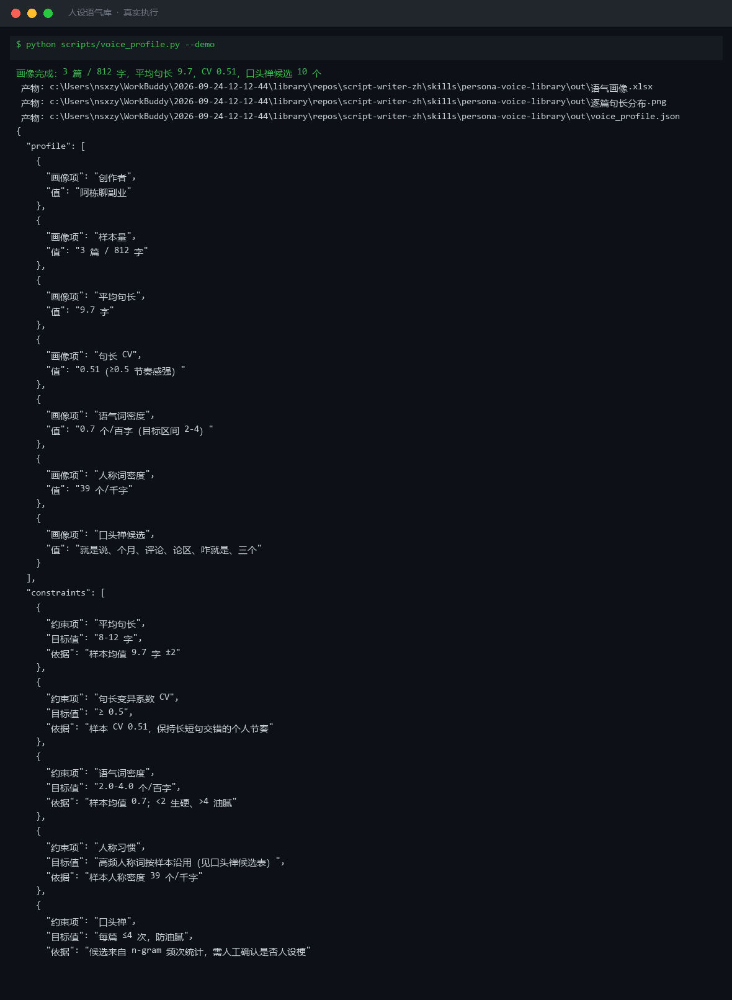
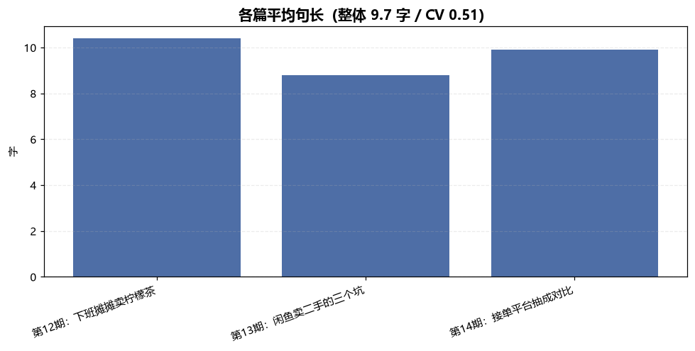
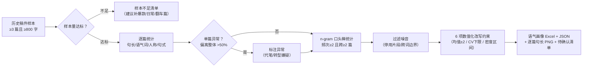

# 人设语气库 Persona Voice Library

> 原子技能 ｜ 属于「脚本创作师」 ｜ 自媒体创作者客群 ｜ T1 产物型（脚本交付真实文件）
>
> **从历史稿件里统计出「这个人平时怎么说话」，沉淀成可执行改写约束，让书面稿改完像「他本人写的」。**
> 五维画像全量化（句长 / 语气词 / 人称 / 句式 / 口头禅）· 6 项数值化改写约束 · 口头禅 n-gram 统计候选 · 一次运行输出 Excel 画像 + 逐篇句长图



🎬 **[▶ 观看演示视频](docs/assets/demo.mp4)** — 四幕数据叙事：业务钩子 → 真实执行 → 指标条形图生长 → 交付物

*上图来自真实执行：3 篇 / 812 字样本 → 平均句长 9.7 字、CV 0.51、语气词 0.7 个/百字、口头禅候选 10 个，并生成 6 项改写约束，产物落盘 Excel + PNG + JSON。*

---

## 它算什么（五维画像，全部量化）

| 维度 | 统计口径 | 目标 / 判定 |
|---|---|---|
| S1 句长习惯 | 平均句长、CV、短句（≤8 字）占比 | 典型口播创作者 8-15 字、CV ≥0.5；改写目标 = 均值 ±2 字 |
| S2 语气词密度 | 「吧/呢/哈/啊/呗/嘛/啦/哟/哦/呀」/百字 | 2-4 个/百字；<2 生硬像念文件，>4 油腻像装可爱 |
| S3 人称习惯 | 「我/你/咱们/家人们/兄弟们/宝子们/老铁」/千字 | 「你」密度 <10 个/千字 = 自说自话；复数称呼不得混用 |
| S4 句式习惯 | 疑问句 / 感叹句占比 | 疑问句 <5% 的创作者改写时要补提问式结尾 |
| S5 口头禅候选 | 跨稿复现 2-3 字高频片段（频次 ≥2 且跨 ≥2 篇） | 统计候选 ≠ 结论，创作者确认后启用，**每篇 ≤4 次** |

**改写约束清单（画像的交付形态，供 colloquial-rewrite 直接调用）**：

| 约束项 | 来源 |
|---|---|
| 平均句长目标 | 样本均值 ±2 字 |
| 句长 CV 下限 | max(0.5, 样本 CV − 0.05) |
| 语气词密度区间 | 样本均值 ±0.5，且夹在 1-5 内 |
| 人称词 | 按样本沿用，不得换称呼 |
| 口头禅清单 | 创作者确认后启用，每篇 ≤4 次 |
| 句式配比 | 疑问/感叹句按样本占比 |

**样本门槛**：≥3 篇且合计 ≥800 字才出画像；不足时输出「样本不足清单」（建议补爆款篇 + 日常篇 + 翻车篇各一）。逐篇平均句长偏离整体 50% 以上要标注（可能是代笔或转型期作品）。

## 真实输入 → 真实输出

**输入**（`examples/input.json`）：创作者「阿栋聊副业」3 篇口播稿（柠檬茶摊 / 闲鱼三个坑 / 平台抽成对比），合计 812 字。

**输出**（脚本实跑，画像汇总）：

| 画像项 | 值 | 说明 |
|---|---|---|
| 样本量 | 3 篇 / 812 字 | 达标（≥3 篇且 ≥800 字） |
| 平均句长 | 9.7 字 | 改写目标 = 8-12 字 |
| 句长 CV | 0.51 | ≥0.5，长短句交错节奏成型 |
| 语气词密度 | 0.7 个/百字 | 低于 2-4 目标区间 → 进待确认清单 |
| 人称词密度 | 39 个/千字 | 高频称呼：你 / 咱们 / 家人们 / 兄弟们 / 姐妹们 |
| 口头禅候选 | 10 个 | 全部「待创作者确认」 |

**口头禅候选节选**（n-gram 统计 → 人工甄别）：

| 候选 | 频次 | 跨篇 | 模型初判 |
|---|---|---|---|
| 就是说 | 5 | 3 | 大概率人设梗（「咱就是说」跨 3 篇复现） |
| 你别 | 3 | 2 | 可疑人设梗（「你别侥幸/你别踩/别犹豫」） |
| 个月 | 4 | 3 | 巧合（「第X个月」量词组合） |
| 十块 | 3 | 2 | 巧合（价格词） |

**逐篇统计**（第 12/13/14 期：平均句长 10.4/8.8/9.9 字，CV 0.47/0.45/0.57，疑问句 4%/7%/0%）——逐篇无异常，无代笔嫌疑。完整报告见 [`examples/output.md`](examples/output.md)。

**产物**（out/ 实跑落盘）：

| 文件 | 说明 |
|---|---|
| `out/语气画像.xlsx` | 画像汇总 / 逐篇统计 / 口头禅候选 / 改写约束 4 sheet |
| `out/逐篇句长分布.png` | 各篇平均句长柱状图 |
| `out/voice_profile.json` | 机器可读画像（profile / per_sample / gram_candidates / constraints） |



*实跑产物：三篇平均句长 8.8-10.4 字，短口播风格稳定。*

## 处理流水线



## 快速开始

**方式一：提示词（任意 AI 工具）**

```text
1. 打开 prompt.txt，全文复制
2. 粘贴到 Coze / WorkBuddy / Dify / Claude / ChatGPT
3. 按 schema.json 的输入规格提供：创作者名称 + ≥3 篇历史稿件
```

**方式二：脚本（零 AI 依赖，确定性统计）**

```bash
# 演示模式（内置 3 篇真实风格样本）
python scripts/voice_profile.py --demo
# 指定输入
python scripts/voice_profile.py --input examples/input.json --outdir out
```

依赖：仅 Python 标准库。口头禅候选是**统计结果，不是结论**——是否人设梗由创作者确认（「咱就是说」是梗，「所以接单」是巧合）。

## 面向谁 / 什么时候用

| ✅ 该用 | ❌ 别用 |
|---|---|
| 做口语化改写 / 钩子文案前，先沉淀风格约束 | 凭空发明人设（画像只能来自样本统计） |
| 多人代笔团队统一「像本人」的验收口径 | 把统计候选直接当口头禅写入约束（须人工确认） |
| 账号风格漂移后重新校准目标值 | 跨账号复用样本画像（样本属创作者私有） |
| 批量历史稿件一次性统计（脚本模式） | 样本含违禁内容时沉淀违禁表达（只做风格统计） |

## 边界与合规

- 本资产输出为 **AI 辅助生成内容**，交付前必须人工审核，并按平台要求完成 AI 内容标识
- 画像基于统计，**风格相似 ≠ 本人对稿认可**；改写约束仅约束风格
- 不豁免敏感词审查：发布前仍须过 `sensitive-word-precheck`
- 样本属创作者私有内容，仅用于该创作者自己的画像，**不跨账号复用**

## 文件地图

```text
├── README.md                    ← 本文件
├── SKILL.md                     ← 资产定义（元信息 / 契约 / 边界）
├── prompt.txt                   ← 提示词本体（五维画像 + 约束形态 + 输出格式）
├── schema.json                  ← 输入输出契约（机器可读）
├── scripts/voice_profile.py     ← 确定性统计脚本（五维画像 → Excel/JSON/PNG）
├── examples/                    ← 真实输入（3 篇样本）+ 脚本实跑输出
├── docs/                        ← 9 项配套文档（架构 / 流程 / 场景 / 测试报告…）
└── out/                         ← 实跑产物（语气画像.xlsx / 逐篇句长分布.png / voice_profile.json）
```

---

*本资产遵循 [bangwozuo 数字员工资产规范](https://github.com/bangwozuo/digital-employee-spec) v3.0 ｜ [所属员工：脚本创作师](../../) ｜ [总入口](https://github.com/bangwozuo/digital-employees-hub-zh)*
