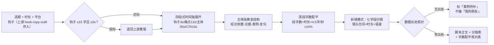

# 脚本结构生成 Script Structure Generate

> 原子技能 ｜ 属于「脚本创作师」 ｜ 自媒体创作者客群 ｜ T2 纯提示词型
>
> **把选题变成能直接开拍的脚本——每段台词有时长预算，每个镜头有画面与字幕，全片字数和语速对得上表。**
> 四段式时间轴硬约束（钩子/痛点/主体/CTA）· 语速配平数学（4-5 字/秒）· 分镜七字段拆镜模式 · 四平台时长适配规则


*上图来自实跑产物渲染：选题「副业避坑」60 秒稿 → 全文 256 字、语速 4.27 字/秒，四段全部配平达标，13 个分镜逐字对齐段落脚本，数据出处逐条核对无编造。*

---

## 结构模板（四段式，时间轴硬约束）

| 时段 | 段落 | 任务 | 时长预算（60s 基准） | 口播字数 |
|---|---|---|---|---|
| 0-3s | 钩子 | 一句话钉住人 | 3s | ≤15 字 |
| 3-15s | 痛点/背景 | 让观众对号入座 | 12s | 50-60 字 |
| 15-50s | 干货/剧情主体 | 交付承诺的价值 | 35s | 140-180 字 |
| 50-60s | 结尾 CTA | 转化动作或互动提问 | 10s | 40-50 字 |

其他时长按比例缩放（±2s）；30s 短版钩子占 3s 不能缩。知识类主体段内部用**「结论前置-论据-案例-金句」**黄金结构——先给答案，再给论据，再用具体案例坐实，金句收束。

## 语速与字数（配平的数学）

中文口播 **4-5 字/秒**：

| 成片时长 | 口播总字数 |
|---|---|
| 30s | 130-150 字 |
| 45s | 200-225 字 |
| 60s | 240-300 字 |
| 90s | 360-450 字 |

配平规则：**逐段核字数**——段内台词字数 = 段时长 × 目标语速（默认 4.5 字/秒），单段超出预算 ±10% 就要增删。两个死线：语速 >6 字/秒 = 念不完；<3.5 字/秒 = 拖，是划走高发区。

## 分镜七字段（拆镜模式，缺一不可）

`镜头号` / `景别`（特写·近景·中景·全景）/ `时长` / `画面`（具体到动作：不写「拍产品」，要写「手拧开瓶盖，泡沫涌到瓶口」）/ `台词` / `字幕`（一行 ≤15 字）/ `音效`（无则写「—」）。

台词字数 = 时长 × 语速，**超字数必超时**：3s 镜头最多 13-14 字台词。

## 平台时长适配（多平台要重剪不是搬运）

| 平台 | 时长规则 |
|---|---|
| 抖音 | ≤60s；>60s 需开通中视频计划才有完整流量 |
| B站 | 3-10 分钟，前期低于 1 分钟反而难起量 |
| 小红书 | ≤4 分钟，调性偏「教程感/分享感」 |
| 视频号 | ≤60s，前 5s 决定社交推荐 |

60s 转 B 站：主体段扩案例，钩子可放缓到 15 秒（B 站有封面标题兜底）；60s 转 30s：痛点砍半、主体只留 1 论据 1 案例、CTA 压成一句。

## 真实输入 → 真实输出

**输入**（`examples/input.json`）：选题「副业避坑」（真实素材：首月副业 3800 元、低价单占 60% 单量贡献 20% 收入、甲方拖两周改八稿）、60 秒、抖音、上游钩子传入、storyboard 模式。

**输出**（按 prompt 实走，脚本正文节选）：

> 【0-3s 钩子】副业第一个月，我踩了三个坑（12 字）
> 【3-15s 痛点】别急着学人家月入过万。先听我说说我怎么亏的。……（52 字）
> 【15-50s 主体】先说结论：新人的钱和力气，多半耗在三个坑上。坑一，低价单接太多。……记住：先跑通，再升级。（148 字）
> 【50-60s CTA】这三个坑，你踩过哪个？评论区告诉我……（44 字）

**分镜表节选**（完整 13 镜见 [`examples/output.md`](examples/output.md)）：

| # | 景别 | 时长 | 画面 | 台词 | 字幕 | 音效 |
|---|---|---|---|---|---|---|
| 1 | 近景 | 3s | 对镜头开口，手比「三」 | 副业第一个月，我踩了三个坑 | 我踩了三个坑 | whoosh |
| 6 | 特写 | 8s | 接单记录滚动，低价单高亮 | 我头一个月六成的单是低价单，忙得要死，只贡献两成收入 | 60% 单量 → 20% 收入 | — |
| 11 | 近景 | 2s | 停顿看镜头 | 记住：先跑通，再升级 | 先跑通 再升级 | 金句音效 |

**字数配平核对（全部 ✅）**：

| 段落 | 时长 | 台词字数 | 语速 | 判定 |
|---|---|---|---|---|
| 钩子 | 3s | 12 | 4.00 | ✅（≤15 字） |
| 痛点 | 12s | 52 | 4.33 | ✅（50-60 字预算内） |
| 主体 | 35s | 148 | 4.23 | ✅（140-180 字预算内） |
| CTA | 10s | 44 | 4.40 | ✅（40-50 字预算内） |
| **全文** | **60s** | **256** | **4.27** | ✅（240-300 字区间） |

**数据出处核对**：六成低价单/两成收入、拖两周改八稿均来自输入 evidence；首月收入 3800 本稿未引用（避免堆数字）；无编造数据，BGM 仅风格要求未指定曲目。

## 处理流水线



## 快速开始

**方式一：提示词（任意 AI 工具）**

```text
1. 打开 prompt.txt，全文复制
2. 粘贴到 Coze / WorkBuddy / Dify / Claude / ChatGPT
3. 按 schema.json 的输入规格提供：选题（含真实素材）+ 时长 + 平台 + 钩子 + 模式
```

**方式二：链路成套**

- 上游：`hook-copy-craft` 锻钩子 → 本资产成稿拆镜
- 下游：`storyboard-shotlist-flow` 生成拍摄清单；交付前过 `ai-trace-check` 复检

## 面向谁 / 什么时候用

| ✅ 该用 | ❌ 别用 |
|---|---|
| 选题确定后，直接产出可开拍脚本与分镜 | 编造数据与案例（无出处标「案例待补」） |
| 多平台分发时按平台规则重剪适配 | 一稿原样搬运到不同平台 |
| 需要每段字数/语速可核对的交付稿 | 交付不配平的脚本（字数没数过 = 没写完） |
| 医疗健康类内容留免责话术位 | CTA 虚假承诺（「看完包会」这类话术不写） |

## 边界与合规

- 本资产输出为 **AI 辅助生成内容**，成片按平台规则完成 AI 标识，发布前人工确认
- CTA 不做虚假承诺；脚本只到「可拍摄」为止，不含拍摄剪辑执行
- BGM 只写风格要求（如「轻快鼓点」），**不指定可能侵权商用的具体曲目**
- 医疗健康类内容主体段必须带免责话术位（「具体遵医嘱」字幕位），不引用未核实数据

## 文件地图

```text
├── README.md                ← 本文件
├── SKILL.md                 ← 资产定义（元信息 / 契约 / 边界）
├── prompt.txt               ← 提示词本体（四段模板 + 配平数学 + 分镜字段）
├── schema.json              ← 输入输出契约（机器可读）
├── examples/                ← 真实输入（选题+素材）+ 实走输出（脚本+分镜+配平表）
└── docs/                    ← 9 项配套文档（架构 / 流程 / 场景 / 测试报告…）
```

---

*本资产遵循 [bangwozuo 数字员工资产规范](https://github.com/bangwozuo/digital-employee-spec) v3.0 ｜ [所属员工：脚本创作师](../../) ｜ [总入口](https://github.com/bangwozuo/digital-employees-hub-zh)*
