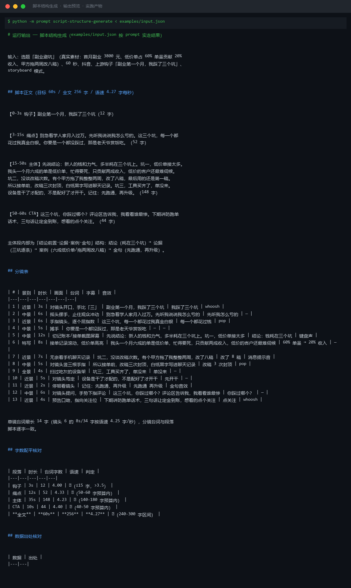

# 截图与录屏

> 以下素材均来自**真实执行**：`--run` 实拍终端 / 实跑产物文件，无摆拍。

## 演示视频


*四幕创作叙事（Hyperframes 动态渲染 19s）：业务钩子 → 真实执行 → 输入要点到成稿演变 → 交付物*

## 执行截图




---

## 附录：实跑输出明细

> 本资产为纯提示词客户端资产，无界面可截图。以下为**实跑运行效果**。

## 运行效果

### 输入

```json
{
  "topic": "AI 工具在小微企业中的应用",
  "duration": "60 秒",
  "platform": "小红书"
}

```

### 输出

## 脚本正文

（0-3s 钩子）
你以为 AI 是大厂专利？我开了家 5 人小公司，反而比大厂用得更狠。

（3-20s 痛点）
之前我们每天花 3 小时做客服回复、写文案、整理表格。招人吧，预算不够；不招吧，自己累垮。

（20-45s 论证）
后来试了 3 个 AI 工具：自动回复用智能客服，文案用生成助手，表格用数据分析。结果客服响应快了 5 倍，文案产出从 1 小时缩到 10 分钟。

（45-60s 转化）
小微企业最大的优势就是船小好调头。AI 不是替代人，是让你一个人干三个人的活。评论区扣 1，我把这 3 个工具清单发你。

## 分镜表

| # | 时间 | 画面内容 | 景别/运镜 | 口播/字幕 |
|---|---|---|---|---|
| 1 | 0-3s | 博主直视镜头，背景为简洁办公桌面 | 中景/固定 | 你以为 AI 是大厂专利？ |
| 2 | 3-20s | 切到手机屏幕上密密麻麻的消息通知，再切回博主无奈表情 | 近景/切换 | 之前我们每天花 3 小时做客服回复... |
| 3 | 20-45s | 电脑屏幕展示 AI 工具界面（可用录屏或模拟界面） | 特写/慢推 | 后来试了 3 个 AI 工具... |
| 4 | 45-60s | 博主微笑，双手比「1」，屏幕弹出引导关注图标 | 中景/固定 | 评论区扣 1，我把清单发你 |

## 拍摄清单

1. 手机一部（拍摄主体画面）
2. 简易三脚架或桌面支架
3. 自然光源或环形补光灯
4. 电脑屏幕录屏（用于展示 AI 工具界面）
5. 安静室内环境，避免背景杂音

*AI 生成内容*

---

*运行效果由实跑验证生成*
