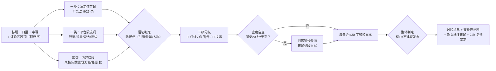

# 敏感词预审 Sensitive Word Precheck

> 原子技能 ｜ 属于「脚本创作师」 ｜ 自媒体创作者客群 ｜ T2 纯提示词型
>
> **发布前把会被限流、下架、封禁的表述挑出来，分级给出 20 字内可直接落笔的替换写法。**
> 三类规则逐类扫描（法定违禁 / 平台限流 / 内容红线）· 三级判定（🔴红线 / 🟡警告 / 🔵提示）· 语境防误伤 · 密度自查与 24 小时复扫闭环


*上图来自实跑产物渲染：121 字抖音口播稿（副业收益类）命中 8 项——红线 5 / 警告 2 / 提示 1，判定「不建议发布」，每条给出依据与替换写法。*

---

## 它查什么（三类规则，逐类扫描）

### 一类：法定违禁词（红线，必须改）

| 类型 | 例词 | 依据 |
|---|---|---|
| 绝对化用语 | 最、第一、唯一、顶级、国家级、100%、彻底、根治、永不 | 《广告法》第九条 |
| 收益承诺 | 稳赚、保本、零风险、日入过万 | 《广告法》第 25 条（金融需持牌，带货教程同样适用） |
| 虚假承诺 | 看完包会、不涨粉你打我、三天见效 | 无法兑现的承诺即虚假宣传 |
| 资质类 | 医疗/金融/法律内容无资质出镜或引用 | 需相应资质或免责 |

### 二类：平台限流词（警告，建议改——软性违规不通知，最难自查）

| 类型 | 示例 | 平台口径 |
|---|---|---|
| 导流词 | 加微信/VX/私信领/扫码/外链 | 抖音、小红书最严，站外导流直接扣分 |
| 诱导词 | 点赞返现/关注领取/评论区扣1抽奖 | 诱导互动需官方活动工具，口播硬诱导限流 |
| 夸大词 | 神器/天花板/绝绝子/史上最 | 营销强化词堆叠降推荐权重 |
| 蹭热点擦边 | 灾难/悲剧/争议人物玩梗 | 一律红线，不分平台 |

平台特有：小红书笔记含「代购/免税/清仓」易判营销号；抖音口播念出「抖音」以外平台名（「去某音看」是导流，「全网最全」没事）。

### 三类：内容红线（红线，直接劝阻）

1. **未核实数据**——「据说 90% 的人都……」无出处 → 红线
2. **医疗健康断言**——治疗/治愈/根治/替代药物，健康内容必须加免责
3. **BGM 版权**——脚本备注的 BGM 非平台曲库内曲目 → 警告（商用侵权是封号级）
4. **低俗与擦边**——不提供任何「擦边但能过」的建议

## 三级判定

| 级别 | 含义 | 处理 |
|---|---|---|
| 🔴 红线 | 法定违禁或平台下架级 | **必须改**，给出替换写法 |
| 🟡 警告 | 高概率限流/降权 | 给出保守写法 |
| 🔵 提示 | 需补充材料或资质 | 说明缺什么 |

整体判定：有 🔴 = 不建议发布；只有 🟡 = 修改后发布；全绿 = 通过。

**语境防误伤**：「第一人称的我」不是排名「第一」；引述用户评论原话标注「引用」；「天花板」用比喻（「房顶天花板」）不算夸大词。**密度自查**：同类违规词 1000 字内命中 ≥3 处判「营销号倾向」，建议整段重写而非逐词替换。**复扫闭环**：修改稿 24 小时内必须复扫——「全网第一」改「全网前三」仍是绝对化，不复扫等于没改。

## 真实输入 → 真实输出

**输入**（`examples/input.json`，121 字高风险密集稿）：

> 副业赚钱最靠谱的一个路子，小白也能稳赚不赔！……月入五万不是梦。据统计，90% 的上班族都在搞副业。……想要的加微信领资料，评论区扣1抽奖送课……

**输出**（按 prompt 实走，风险清单节选）：

| # | 级别 | 原文片段 | 命中规则 | 依据 | 建议改法 |
|---|---|---|---|---|---|
| 1 | 🔴 | 稳赚不赔 | 收益承诺 | 《广告法》第 25 条 | 「收益有波动，我做的时候月均 3800（附记账截图）」 |
| 3 | 🔴 | 月入五万不是梦 | 虚假收益暗示 | 虚假宣传 + 无法核实 | 「第一个月副业收入 3800，截图在这」 |
| 5 | 🔴 | 加微信领资料 | 站外导流 | 抖音社区规范 | 「资料放在主页橱窗/评论区置顶（平台内交付）」 |
| 7 | 🟡 | 评论区扣1抽奖 | 诱导互动 | 需官方抽奖工具 | 改用抖音官方「评论区抽奖」组件 |

完整 8 条 + 需补充材料 + 免责标注建议见 [`examples/output.md`](examples/output.md)。整体判定：**不建议发布**。

**免责标注建议实走结果**：字幕页固定一行「收益因人而异，不构成投资建议」；口播结尾加「以上是我个人经历，不保证人人如此」。

## 处理流水线



## 快速开始

**方式一：提示词（任意 AI 工具）**

```text
1. 打开 prompt.txt，全文复制
2. 粘贴到 Coze / WorkBuddy / Dify / Claude / ChatGPT
3. 按 schema.json 的输入规格提供：文稿全文 + 目标平台 + 类目
```

**方式二：链路成套**

- 交付前强制闸门：改写/降 AI 味后**必须复扫**（见 `ai-trace-detect-reduce-flow`）
- 替换写法控制在 20 字内——超长口播念不完，宁可拆成两句

## 面向谁 / 什么时候用

| ✅ 该用 | ❌ 别用 |
|---|---|
| 口播稿/图文发布前的最后一道合规闸门 | 替代平台官方审核（规则月月更新，以官方为准） |
| 收益类/健康类等高风险类目的逐句检查 | 提供「谐音/拆字/拼音替代」规避审核（违规协助不做） |
| 修改稿 24 小时内复扫替换写法 | 审查内容观点（只审合规，不管观点对错） |
| 涉法律争议表述建议法务复核 | 给「应该没问题吧」模糊结论（要么过、要么列清单） |

## 边界与合规

- 本资产输出为 **AI 辅助生成内容**，本预审为辅助自查，**不能替代**平台官方审核
- 平台规则以官方公示的最新版本为准，输出必须带「以平台官方最新规范为准」
- 不提供规避审核的写法（谐音/拆字/拼音替代 = 违规协助）
- 涉及法律争议的表述建议法务复核；对外发布保留人工确认环节

## 文件地图

```text
├── README.md                ← 本文件
├── SKILL.md                 ← 资产定义（元信息 / 契约 / 边界）
├── prompt.txt               ← 提示词本体（三类规则 + 分级 + 复扫闭环）
├── schema.json              ← 输入输出契约（机器可读）
├── examples/                ← 真实输入（风险稿）+ 实走输出（8 条风险清单）
└── docs/                    ← 9 项配套文档（架构 / 流程 / 场景 / 测试报告…）
```

---

*本资产遵循 [bangwozuo 数字员工资产规范](https://github.com/bangwozuo/digital-employee-spec) v3.0 ｜ [所属员工：脚本创作师](../../) ｜ [总入口](https://github.com/bangwozuo/digital-employees-hub-zh)*
