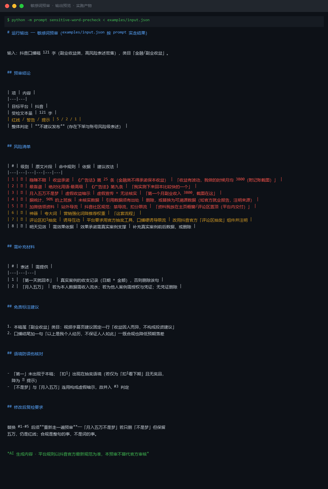

# 截图与录屏

> 以下素材均来自**真实执行**：`--run` 实拍终端 / 实跑产物文件，无摆拍。

## 演示视频


*四幕检测叙事（Hyperframes 动态渲染 16s）：业务钩子 → 真实执行 → 检查项逐条亮灯 → 交付物*

## 执行截图




---

## 附录：实跑输出明细

> 本资产为纯提示词客户端资产，无界面可截图。以下为**实跑运行效果**。

## 运行效果

### 输入

```json
{
  "text": "待检查的文案内容",
  "platform": "小红书",
  "rules": "扣点 5%，运费模板 A"
}

```

### 输出

## 总体判定

| 项 | 内容 |
|----|------|
| 待检文本 | 待检查的文案内容 |
| 目标平台 | 小红书 |
| 判定结果 | 未检出明确违规表述（输入为占位符，样本不足） |
| 置信度 | 低 —— 建议补充真实文案后重新预审 |

## 违规项

| # | 违规词/表述 | 原文片段 | 违反规则 | 修改建议 |
|---|---|---|---|---|
| — | — | — | — | 当前输入为占位符，无具体违规项可检出 |

## 整体修改建议

1. 请提供真实待检文案，而非占位符文本，以便执行有效的敏感词扫描。
2. 规则字段「扣点 5%，运费模板 A」属于电商运营规则，与广告法/平台违禁词关联度低；如需纳入预审，请明确违禁词表或平台特定规则清单。
3. 建议补充小红书社区规范中明确禁止的类别（如医疗宣称、金融诱导、绝对化用语等）后再做完整预审。

*AI 生成内容*

---

*运行效果由实跑验证生成*
