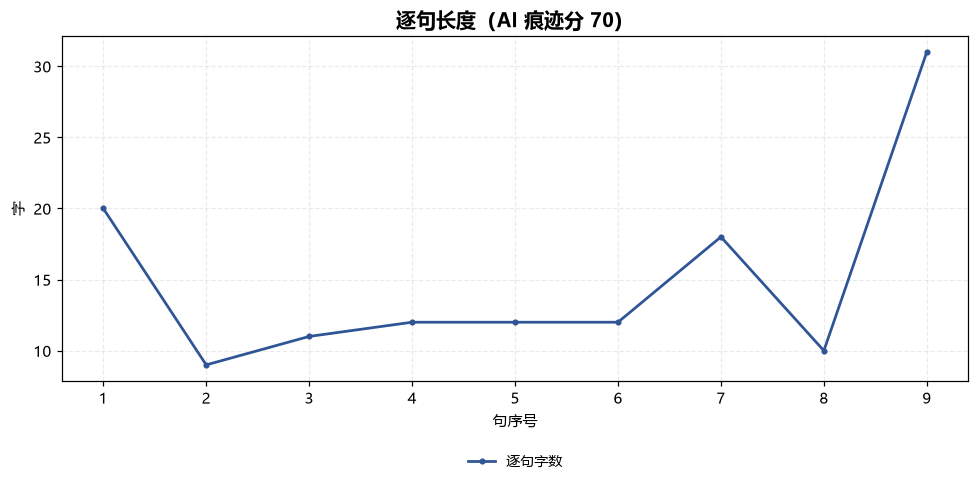
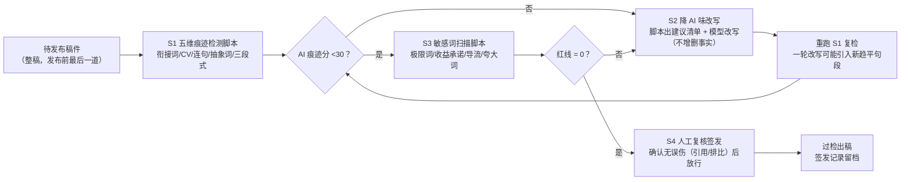

# AI 痕迹检测与降 AI 味 Trace Detect Reduce Flow

> 工作流 ｜ 属于「脚本创作师」 ｜ 自媒体创作者客群 ｜ T3 编排型 ｜ 触发：人工（发布前强制）
>
> **发布前的强制闸门：五维 AI 痕迹检测 → 降 AI 味改写 → 敏感词扫描 → 闸门判定。痕迹分达标 + 敏感词零红线，才放行。**
> 3 步脚本实跑 + 1 步人工签发 · 五维权重计分（35/30/16/15/10）· 两条线独立判定（任一红线即打回）· 一次运行输出 Excel 检查表 + 句长分布图
>
> 人工复核改稿 30min/篇 → 按日更计月省约 15h×¥30 ≈ ¥450


🎬 **[▶ 观看演示视频（在线播放）](https://cdn.jsdelivr.net/gh/bangwozuo/script-writer-zh@main/workflows/ai-trace-detect-reduce-flow/docs/assets/demo.mp4) · [GitHub 页](https://github.com/bangwozuo/script-writer-zh/blob/main/workflows/ai-trace-detect-reduce-flow/docs/assets/demo.mp4)** — 四幕检测叙事：业务钩子 → 真实执行 → 检查项逐条亮灯 → 交付物

*上图来自真实执行：135 字 AI 腔重灾区稿件，闸门判定「打回重改（不得发布）」——AI 痕迹分 70（衔接词 59.3/千字 🔴、抽象词 14.8/千字 🔴、完美三段式 🔴），敏感词红线 1（稳赚）/ 警告 2（神器/加微信），产物落盘 Excel + PNG + JSON。*

---

## 链路（三步 + 人工，逐步执行）

### S1 五维 AI 痕迹检测（ai-trace-check，脚本承担）

对稿件跑五维量化检测，输出 AI 痕迹分 0-100。五维是统计量，**只认脚本实跑数值**，模型不得口算：

| 维度 | 指标 | 权重 |
|---|---|---|
| 衔接词密度 | 首先/其次/总之/综上所述/值得注意的是 等，>3 个/千字判 AI 腔 | 35 |
| 句长起伏 | CV = 句长σ ÷ 平均句长，≥0.5 人味，<0.4 判 AI 腔 | 30 |
| 均长连句 | 连续 3 句长度差 ≤2 字且 >18 字（统计指纹，一票判 AI 腔） | 16 |
| 抽象词 | 赋能/抓手/闭环/深度/全面提升，>2 个/千字判汇报腔 | 15 |
| 完美三段式 | 首先…其次…最后/总之 齐活 | 10 |

### S2 降 AI 味改写（colloquial-rewrite，模型承担 + 脚本出建议清单）

按 S1 的逐处命中生成**替换建议清单**（脚本自动生成初版）：

- 衔接词：大多直接删除，或换口语（首先→「先说」；然而→「结果」；事实上→「其实」；值得注意的是→「划重点」；众所周知→删，观众未必知道）
- 抽象词：换具体动作 + 数字（「助力创作者」→「帮创作者每月多赚 X 元」）
- 三段式：改「结论前置 + 自然展开」
- CV 补救：每 3-5 句插一个 ≤6 字短句呼吸口

模型负责语境复核（引用原文、有意排比不算命中）与实际改写——**改写不得增删事实**。改完必须重跑 S1 复检，达标（<30）才算降完。

### S3 敏感词扫描（sensitive-word-precheck，脚本承担）

四组词表扫描：极限词（最/第一/唯一/100%/彻底）、收益承诺（稳赚/保本/零风险/日入过万）、导流与诱导（加微信/私信领/评论区扣1抽奖/点赞返现）、夸大词（神器/天花板/史上最）。命中即出「级别/原文/依据/建议改法」四元组。

### S4 闸门判定与人工复核

| 条件 | 判定 |
|---|---|
| AI 痕迹分 ≥55 或敏感词红线 ≥1 | 🔴 打回重改（不得发布） |
| 分数 30-54 或仅警告级命中 | 🟡 需微调，改后复检 |
| 分数 <30 且零命中 | ✅ 通过 → 人工复核签发 |

人工复核是最后一道闸：脚本与模型都可能误伤（有意排比、引用原文），人确认后才算过闸。

## 真实输入 → 真实输出

**输入**（`examples/input.json`）：AI 腔重灾区稿件 135 字（「在当今/首先/其次/此外/值得注意的是/与此同时/综上所述」+「神器/稳赚不赔/加微信」）。

**输出**（脚本实跑）：

**闸门判定**：AI 痕迹分 **70**（≥55 高 AI 痕迹）｜ 敏感词红线 1 / 警告 2 ｜ 判定**打回重改（不得发布）**

**五维明细**：

| 维度 | 实测 | 阈值 | 判定 |
|---|---|---|---|
| 衔接词密度 | 59.3 个/千字（8 处） | <3 | 🔴（权重 35 封顶） |
| 句长 CV | 0.44 | ≥0.5 | 🟡（权重 10） |
| 均长连句 | 0 组 | 0 组 | ✅ |
| 抽象词密度 | 14.8 个/千字（打造/全面提升） | <2 | 🔴（权重 15 封顶） |
| 完美三段式 | 是（首先/其次/此外+综上所述） | 无 | 🔴（权重 10） |

计分：35 + 10 + 0 + 15 + 10 = **70**。

**改写清单**（8 条逐处替换建议，节选）：在当今→（删除，直接说现象）；首先→「先说」或删；值得注意的是→「划重点」；综上/综上所述→（删除整句总结，改结论前置）；「打造个人品牌」→「让人记住你」；「实现个人价值的全面提升」→整句删除（口播稿里这句是零信息填充）。

**敏感词命中**：

| 级别 | 原文片段 | 命中规则 | 依据 | 建议改法 |
|---|---|---|---|---|
| 🔴 红线 | 稳赚 | 收益承诺 | 《广告法》第二十五条 | 改「收益有波动，附本人真实记录」 |
| 🟡 警告 | 神器 | 夸大词堆叠 | 平台降推荐权重 | 改具体描述 |
| 🟡 警告 | 加微信 | 导流/诱导 | 平台社区规范 | 改平台内交付（主页橱窗/官方组件） |

**句段明细**（11 句中 8 句命中，节选）：句 1「在当今数字化时代，副业已经成为很多人的选择」（15 字，衔接词:在当今 🔴）；句 5「值得注意的是，副业不是躺赚」（11 字，衔接词:值得注意的是 🔴）。

**产物**（out/ 实跑落盘）：

| 文件 | 说明 |
|---|---|
| `out/降AI味与合规检查表.xlsx` | 检测汇总 / 句段明细 / 改写清单 / 敏感词命中 4 sheet |
| `out/句长分布.png` | 逐句长度折线（9 句，可见 9-15 字趋平形态） |
| `out/trace_reduce_flow.json` | 机器可读结果（verdict/score/rewrite_list/sensitive_hits） |



*实跑产物：9 句句长挤在 9-15 字区间、起伏趋平（CV 0.44），是典型的机器生成节奏。*

## 处理流水线（DAG）



## 快速开始

**方式一：提示词（任意 AI 工具）**

```text
1. 打开 prompt.txt，全文复制
2. 粘贴到 Coze / WorkBuddy / Dify / Claude / ChatGPT
3. 按 schema.json 的输入规格提供：待发布整稿
```

**方式二：脚本（检测与扫描环节零 AI 依赖，确定性执行）**

```bash
# 演示模式（内置 135 字 AI 腔重灾区样例）
python scripts/run_flow.py --demo
# 指定输入
python scripts/run_flow.py --input examples/input.json --outdir out
```

「感觉像人写的」不是判定——痕迹分和词表扫描才是。模型自评自己的稿子必说没问题，五维统计量由脚本实跑。

## 面向谁 / 什么时候用

| ✅ 该用 | ❌ 别用 |
|---|---|
| 每篇稿件发布前的最后一道强制闸门 | 跳过闸门直接交付（「看起来没问题」不算判定） |
| 用模型批量成稿后的降 AI 味整改 | 用模型口算痕迹分（五维是统计量，只认脚本） |
| 敏感词发前预审（两条线独立判定） | 提供规避检测的写法（同义替换骗分不在此列） |
| 改写后复检闭环（改完不复检不放行） | 因痕迹分低而豁免敏感词红线（任一红线即打回） |

## 边界与合规

- 本资产输出为 **AI 辅助生成内容**，对外发布保留人工确认环节，签发放行记录留档
- 本闸门是启发式统计 + 词表扫描，不构成法律意见；敏感词判定依据以《广告法》与平台官方最新规范为准
- 改写只改说法、不增删事实；引用原文、有意排比属可误伤场景，由人工复核兜底
- 请按所在平台要求完成 **AI 生成内容标识**

## 文件地图

```text
├── README.md                  ← 本文件
├── SKILL.md                   ← 工作流定义（链路 / 契约 / 边界）
├── prompt.txt                 ← 编排提示词（S1-S4 链路 + 闸门标准）
├── schema.json                ← 输入输出契约（机器可读）
├── scripts/run_flow.py        ← 五维检测 + 建议清单 + 敏感词扫描（Excel/JSON/PNG）
├── examples/                  ← 真实输入 + 脚本实跑输出
├── docs/                      ← 10 项配套文档（架构 / 流程 / 场景 / 测试报告…）
└── out/                       ← 实跑产物（降AI味与合规检查表.xlsx / 句长分布.png / trace_reduce_flow.json）
```

---

*本资产遵循 [bangwozuo 数字员工资产规范](https://github.com/bangwozuo/digital-employee-spec) v3.0 ｜ [所属员工：脚本创作师](../../) ｜ [总入口](https://github.com/bangwozuo/digital-employees-hub-zh)*
