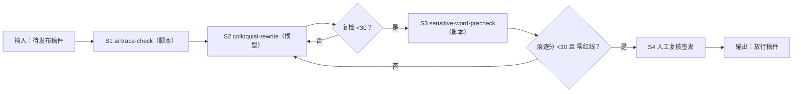

# AI 痕迹检测与降 AI 味

发布前强制闸门：AI 痕迹分达标 + 敏感词零红线，才放行。判定只认脚本实跑数值。

## 元信息

| 字段 | 值 |
|------|-----|
| ID | `de_media_02_wf04` |
| 类型 | **`composite`（复合技能）** |
| 所属员工 | 脚本创作师 |
| 阶段 | `P0` |
| 复杂度 | `M` |
| 触发方式 | 事件（交付前强制闸门） |
| ROI | 避免一篇 AI 腔稿拉低整个账号的推荐权重；限流一次 ≈ 损失 3-7 天自然流量 |
| 资产形态 | 提示词编排 + Python 检测脚本 |

## 能力描述

1. **S1 五维检测**（ai-trace-check 口径，脚本承担）：衔接词密度（>3/千字判
   AI 腔，权重 35）、句长 CV（≥0.5 人味，权重 30）、均长连句（连续 3 句同长
   >18 字一票判 AI 腔，权重 16）、抽象词（>2/千字汇报腔，权重 15）、完美三段式
   （权重 10）→ **AI 痕迹分 0-100**（≥55 高 / 30-54 中 / <30 正常）
2. **S2 降 AI 味改写**（colloquial-rewrite 承担）：逐处替换建议清单（衔接词→
   删除或口语替换、抽象词→人话+数字、三段式→结论前置、CV→短句呼吸口）；
   改写不增删事实，改后必须复检至 <30
3. **S3 敏感词扫描**（sensitive-word-precheck 口径，脚本承担）：极限词 / 收益
   承诺 / 导流诱导 / 夸大词，命中出「级别/原文/依据/建议改法」
4. **S4 闸门判定**：痕迹分 ≥55 或红线 ≥1 → 🔴 打回；30-54 或仅警告 → 🟡
   需微调；否则 ✅ 通过 → 人工复核签发

## 编排的原子技能

| # | 原子技能 | 能力 |
|---|---------|------|
| 1 | [AI 痕迹自检](../../skills/ai-trace-check/) | 五维量化检测与 AI 痕迹分 |
| 2 | [口语化改写](../../skills/colloquial-rewrite/) | 降 AI 味四步改写 |
| 3 | [敏感词预审](../../skills/sensitive-word-precheck/) | 违禁/限流/红线词表审查 |

## 步骤链路（DAG）



## 步骤明细

| # | 步骤 | 技能资产 | 输入 | 输出 | 失败处理 |
|---|------|---------|------|------|---------|
| 1 | 五维检测 | `ai-trace-check`（本流脚本承担） | 稿件 ≥50 字 | AI 痕迹分 + 句段明细 | 稿件过短中止 |
| 2 | 降 AI 味改写 | `colloquial-rewrite` | 痕迹明细 + 替换建议清单 | 改写稿 | 事实增删拒绝；改后必复检 |
| 3 | 敏感词扫描 | `sensitive-word-precheck`（本流脚本承担） | 改写稿 | 红线/警告清单 | 红线独立判定，不豁免 |
| 4 | 人工复核 | （人工） | 复检记录 | 签发放行 | 误伤申诉（有意排比/引用）人工裁定 |

## 输入规格

| 字段 | 类型 | 必填 | 说明 |
|------|------|------|------|
| `text` | string | ✅ | 待发布稿件（≥50 字） |
| `target_duration_s` | number | ⬜ | 目标时长（顺带核字数） |

## 输出规格

| 字段 | 类型 | 说明 |
|------|------|------|
| `verdict` | string | 打回重改（不得发布）/ 需微调 / 通过 |
| `score` | number | AI 痕迹分 0-100 |
| `sentences` | array | 句段级痕迹明细 |
| `rewrite_list` | array | 逐处替换建议（命中词/次数/替换建议） |
| `sensitive_hits` | array | 敏感词命中（级别/原文/规则/依据/改法） |
| 产物 | file | `out/降AI味与合规检查表.xlsx`、`out/句长分布.png`、`out/trace_reduce_flow.json` |

## 错误处理

| 情况 | 处理方式 |
|------|---------|
| 文稿 <50 字 | 中止索要完整稿 |
| 衔接词密度 >3/千字 | 🔴 按替换清单逐处处理 |
| CV <0.4 / 均长连句 | 🔴 插短句呼吸口，打散等长句 |
| 敏感词红线 | 🔴 独立打回，与痕迹分无关 |
| 改写后复检 ≥30 | 回到 S2 继续改，不放行 |

## 使用步骤

### 方式一：纯提示词编排（跨平台）

1. 把 `prompt.txt` 全文粘贴为系统提示词
2. 提供待发布稿件
3. 按 S1→S2→S3 走闸门，S4 人工签发
4. 检测数值用下方脚本实测

### 方式二：带脚本（端到端产物）

```bash
python <WF_DIR>/scripts/run_flow.py --input input.json --outdir out
python <WF_DIR>/scripts/run_flow.py --demo
```

| 平台 | 编排方式 |
|------|---------|
| **Coze / 扣子** | S2 节点填技能 prompt.txt，S1/S3 用代码节点跑检测脚本 |
| **Dify** | Workflow → LLM 节点 + 代码节点 |
| **WorkBuddy** | 新建 Skill 按 prompt.txt 步骤串联 |

## 边界（不做的事）

- ❌ 不跳过闸门——「看起来没问题」不是判定
- ❌ 不口算痕迹分——以脚本汉字实数为准
- ❌ 改写不增删事实
- ❌ 改完不复检不放行
- ❌ 不提供骗过检测的写法
- ❌ 两条线独立判定——痕迹分低不豁免敏感词红线

## 调用示例

**输入**（`examples/input.json`）：AI 腔重灾区稿件（在当今/首先/其次/此外/
值得注意的是/与此同时/综上所述 + 神器/稳赚不赔/加微信）。

**输出**（脚本实跑）：AI 痕迹分 70（衔接词 59.3/千字 8 处、抽象词 14.8/千字、
完美三段式）+ 敏感词红线 1（稳赚不赔）警告 2（神器、加微信）→ 判定
**打回重改（不得发布）**。改写清单 8 条逐处给替换建议（首先→先说/综上所述→
删除整句/值得注意的是→划重点），句段明细 11 句定位到每句。

## 所属工作流

本资产为复合技能（工作流），是所有内容类工作流的**发布前强制闸门**：
上游 `topic-to-script-flow` / `voiceover-colloquial-flow` 的产出都从这里过闸。

## 合规声明

- 输出标注「AI 生成内容」；闸门为启发式统计 + 词表扫描，不构成法律意见
- 敏感词判定以《广告法》与平台官方最新规范为准
- 人工复核签发记录留档；误伤申诉（有意排比/引用原文）由人工裁定

---

*本复合技能遵循 [bangwozuo 数字员工资产规范](https://github.com/bangwozuo/digital-employee-spec) v3.0*
