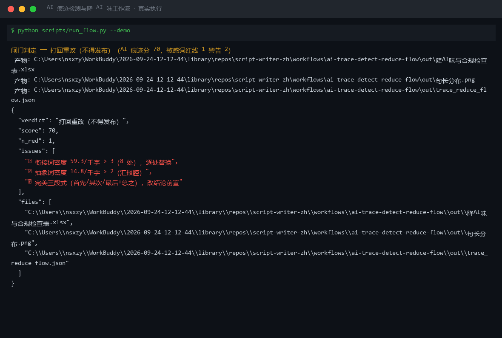

# 截图与录屏

> 以下素材均来自**真实执行**：`--run` 实拍终端 / 实跑产物文件，无摆拍。

## 演示视频


*第二帧为实跑产物图表*

## 执行截图



## 实跑产物

| 文件 | 说明 |
|---|---|
| [`out/trace_reduce_flow.json`](out/trace_reduce_flow.json) | 结构化结果（实跑生成） · 4 KB |
| [`out/句长分布.png`](out/句长分布.png) | 图表产物（实跑生成） · 41 KB |
| [`out/降AI味与合规检查表.xlsx`](out/降AI味与合规检查表.xlsx) | Excel 工作簿（实跑生成） · 9 KB |


---

## 附录：实跑输出明细

> 本资产为纯提示词客户端资产，无界面可截图。以下为**实跑运行效果**。

## 运行效果

### 输入

```json
{
  "input": "请提供工作流的初始输入数据"
}

```

### 输出

## 执行摘要

本次执行因初始输入为占位符，无法完成端到端的 AI 痕迹检测与降 AI 味流程，已按步骤给出各阶段说明与待补充项。

## 分步结果

1. 步骤 1（AI 痕迹自检）：输入缺失待检文本，无法执行句段定位与概率判定。请提供具体文案内容。
2. 步骤 2（敏感词预审）：上一步输出不完整，跳过实际预审，仅给出规则说明。
3. 步骤 3（口语化改写）：上一步输出不完整，跳过实际改写，仅给出改写原则说明。

## 最终交付物

当前无可直接使用的最终输出。请补充以下信息后重新执行：

- **待检文案**：需要检测 AI 痕迹并改写的原始文本。
- **目标平台**（可选）：如小红书、抖音等，用于适配平台调性。
- **阈值规则**（可选）：如对 AI 痕迹概率的容忍度。

补充后，本工作流将按「自检 → 预审 → 改写」顺序输出可直接使用的降 AI 味文案。

*AI 生成内容*

---

*运行效果由实跑验证生成*
