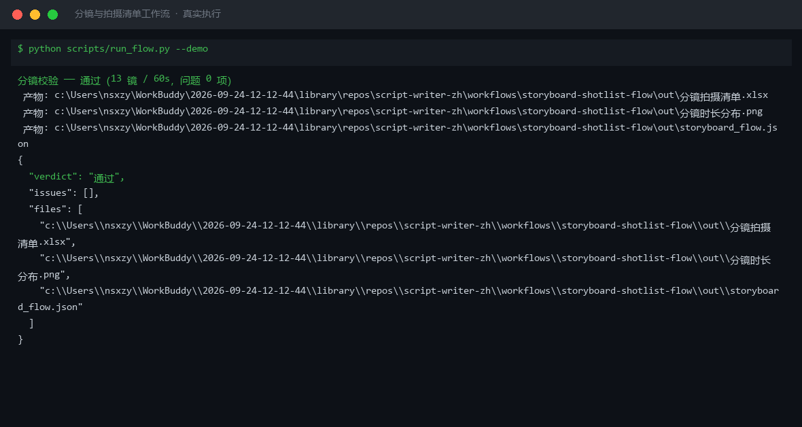
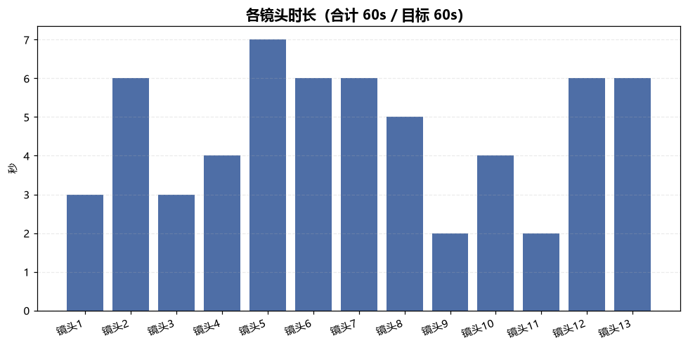
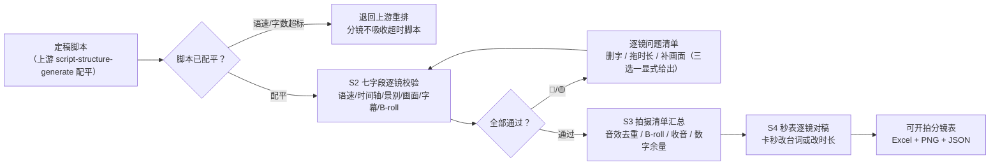

# 分镜与拍摄清单 Storyboard Shotlist Flow

> 工作流 ｜ 属于「脚本创作师」 ｜ 自媒体创作者客群 ｜ T3 编排型 ｜ 触发：人工（按需）
>
> **把定稿脚本拆成「可以直接开拍」的分镜表和拍摄清单——每个镜头七字段齐全、台词念得完、时间轴严丝合缝、音效道具提前列清。**
> 3 步编排 + 1 步人工闸门 · 7 项逐镜量化校验（语速/时长匹配/时间轴/景别/画面/字幕/B-roll）· 超字数必超时死线 · 一次运行输出 Excel 校验表 + 时长分布图
>
> 拍摄准备 0.5-1h → 10min，月省约 8h ≈ ¥240



*上图来自真实执行：13 镜 / 60s 校验判定「通过」（问题 0 项），语速全部落在 3.5-6.0 字/秒区间，产物落盘 Excel + PNG + JSON。*

---

## 链路（三步 + 人工，逐步执行）

### S1 脚本成稿（script-structure-generate，storyboard 模式）

输入选题素材 + 时长 + 平台，输出分段脚本 + 七字段分镜初稿。

失败处理：脚本未配平（段字数/语速超标）→ 退回上游重排。**分镜不吸收超时脚本**——分镜解决不了脚本层面的超时。

### S2 七字段校验（本工作流脚本承担，模型不得口算）

分镜字段：**镜头号 / 景别 / 时长 / 画面 / 台词 / 字幕 / 音效**，缺一不可。

| 检查项 | 标准 | 级别 |
|---|---|---|
| 台词语速 | 3.5-6.0 字/秒（>6 念不完：<6s 的镜头最多时长×6 字） | 🔴 |
| 台词-时长匹配 | <3.5 字/秒 = 台词撑不满时长 | 🟡 |
| 时间轴 | 逐镜连续无重叠，合计 = 目标 ±2s | 超差 🔴 |
| 景别 | 特写/近景/中景/全景 四选一 | 非法 🔴 |
| 画面字段 | 非空且具体到动作（「拍产品」不合格） | 缺失 🔴 |
| 字幕 | 一行 ≤15 字符 | 超长 🔴 |
| 纯画面镜头 | 台词为空须标记 B-roll 确认 | 未确认 🟡 |

### S3 拍摄清单汇总（本工作流脚本承担）

从分镜自动汇总：**音效清单**（全片去重）、纯画面镜头清单（B-roll 单独拍）、收音要点（口播镜头领夹麦 + 环境底音单收）、大数字镜头提醒（留 1-2s 余量）、待修镜头数。

### S4 人工逐镜对稿（不跳过）

拿秒表逐镜念台词：卡秒的镜头改台词或改时长；数字段留余量；确认后才可开拍。

**核心死线**：台词字数 = 时长 × 语速，**超字数必超时**。3s 镜头按 4.5 字/秒最多 13-14 字台词；若台词 20 字，三条路（删 7 字 / 镜头拖到 5s / 加速到 6.7 字/秒念不完）都要在逐镜校验里显式给出。

## 真实输入 → 真实输出

**输入**（`examples/input.json`）：片名「副业避坑：新人最容易踩的三个坑」/ 13 镜 / 目标 60s / 抖音。

**输出**（脚本实跑，逐镜校验节选）：

| 镜头号 | 景别 | 时间轴 | 时长 | 台词字数 | 语速 | 判定 |
|---|---|---|---|---|---|---|
| 1 | 近景 | 0-3s | 3s | 12 | 4.00 | ✅ |
| 5 | 中景 | 16-23s | 7s | 27 | 3.86 | ✅ |
| 13 | 近景 | 54-60s | 6s | 24 | 4.00 | ✅ |

时间轴逐镜连续无重叠（合计 60s = 目标 ±0s）；景别全部合法；字幕最长 14 字符（「60% 单量 → 20% 收入」）。完整 13 镜见 [`examples/output.md`](examples/output.md)。

**拍摄要点（S3 自动汇总）**：音效清单 5 项去重（pop / whoosh / 消息提示音 / 金句音效 / 键盘声）；收音——口播镜头领夹麦 + 环境音单独收底；镜头 5/6/7 含数字台词留 1-2s 余量；待修 0 镜。

**超时检出能力（对照案例）**：把分镜时长拉大到合计 73s 重跑同一脚本，抓出 **10 项问题**——8 镜语速 <3.5 字/秒过稀（最低 2.25）、合计 73s ≠ 60s ±2s、抖音超上限 13s。时长虚标撑不满台词，同样逃不过校验。

**产物**（out/ 实跑落盘）：

| 文件 | 说明 |
|---|---|
| `out/分镜拍摄清单.xlsx` | 校验汇总 / 逐镜校验（🔴 标红）/ 拍摄要点 / 平台核对 4 sheet |
| `out/分镜时长分布.png` | 13 镜时长柱状图 |
| `out/storyboard_flow.json` | 机器可读结果（verdict / rows / shooting / issues） |



*实跑产物：单镜时长 2-12s 分布，主体段长镜头与金句短镜头交错。*

## 处理流水线（DAG）



## 快速开始

**方式一：提示词（任意 AI 工具）**

```text
1. 打开 prompt.txt，全文复制
2. 粘贴到 Coze / WorkBuddy / Dify / Claude / ChatGPT
3. 按 schema.json 的输入规格提供：片名 + 目标时长 + 平台 + 七字段分镜数据
```

**方式二：脚本（校验环节零 AI 依赖，确定性执行）**

```bash
# 演示模式（内置 13 镜真实分镜样例）
python scripts/run_flow.py --demo
# 指定输入
python scripts/run_flow.py --input examples/input.json --outdir out
```

台词语速、时间轴合计全部由脚本按汉字实数统计——不用模型口算。

## 面向谁 / 什么时候用

| ✅ 该用 | ❌ 别用 |
|---|---|
| 脚本定稿后、开拍前的现场准备 | 吸收未配平的脚本（超时问题回上游改） |
| 单人拍摄时一表管收音/音效/B-roll | 用模型口算语速（汉字实数以脚本为准） |
| 台词超时的镜头三选一显式处理 | 画面字段写「拍 XX」（要具体到动作） |
| 出镜合作内容在字幕位保留「探店合作/广告」标注 | 跳过秒表逐镜对稿（那是最后一道闸） |

## 边界与合规

- 本资产输出为 **AI 辅助生成内容**，成片按平台规则完成 AI 标识，发布前人工确认
- 出镜合作/利益相关内容在对应镜头字幕位保留标注（如「探店合作」「广告」）
- **不指定可能侵权商用的 BGM 曲目**——音效清单只写风格与点位
- 本工作流只到「可开拍」为止，不含拍摄剪辑执行

## 文件地图

```text
├── README.md                  ← 本文件
├── SKILL.md                   ← 工作流定义（链路 / 契约 / 边界）
├── prompt.txt                 ← 编排提示词（S1-S4 链路 + 校验死线）
├── schema.json                ← 输入输出契约（机器可读）
├── scripts/run_flow.py        ← S2/S3 确定性脚本（七字段校验+清单汇总 → Excel/JSON/PNG）
├── examples/                  ← 真实输入 + 脚本实跑输出
├── docs/                      ← 9 项配套文档（架构 / 流程 / 场景 / 测试报告…）
└── out/                       ← 实跑产物（分镜拍摄清单.xlsx / 分镜时长分布.png / storyboard_flow.json）
```

---

*本资产遵循 [bangwozuo 数字员工资产规范](https://github.com/bangwozuo/digital-employee-spec) v3.0 ｜ [所属员工：脚本创作师](../../) ｜ [总入口](https://github.com/bangwozuo/digital-employees-hub-zh)*
