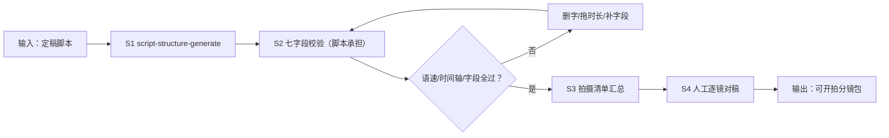

# 分镜与拍摄清单

把定稿脚本拆成可直接开拍的分镜表与拍摄清单：七字段齐全、台词念得完、
现场物料提前列清。

## 元信息

| 字段 | 值 |
|------|-----|
| ID | `de_media_02_wf03` |
| 类型 | **`composite`（复合技能）** |
| 所属员工 | 脚本创作师 |
| 阶段 | `P1` |
| 复杂度 | `S` |
| 触发方式 | 人工（脚本定稿后按需） |
| ROI | 拍前对稿替代拍后补录：省一次补录 ≈ 2 小时 |
| 资产形态 | 提示词编排 + Python 校验脚本 |

## 能力描述

1. **S1 脚本成稿**：上游 `script-structure-generate`（storyboard 模式）产出
   分镜初稿；未配平脚本退回，分镜层不吸收超时
2. **S2 七字段校验**（脚本承担）：台词语速 3.5-6.0 字/秒（>6 念不完 🔴）、
   时间轴连续 ±2s、景别四选一、画面非空且具体、字幕 ≤15 字符、
   纯画面镜头标 B-roll——核心死线：**台词字数 = 时长 × 语速，超字数必超时**
3. **S3 拍摄清单汇总**：音效清单去重、B-roll 清单、收音要点、大数字镜头余量提醒
4. **S4 人工逐镜对稿**：秒表念台词，卡秒镜头删字或拖时长（二选一）后重跑校验

## 编排的原子技能

| # | 原子技能 | 能力 |
|---|---------|------|
| 1 | [脚本结构生成](../../skills/script-structure-generate/) | 四段式成稿 + 七字段分镜初稿 |

## 步骤链路（DAG）



## 步骤明细

| # | 步骤 | 技能资产 | 输入 | 输出 | 失败处理 |
|---|------|---------|------|------|---------|
| 1 | 脚本成稿 | `script-structure-generate` | 选题素材 + 时长 | 分镜初稿（七字段） | 未配平脚本退回上游 |
| 2 | 七字段校验 | 本流脚本 | shots + target + platform | 逐镜校验 + 问题清单 | shots 为空中止；🔴 优先修 |
| 3 | 清单汇总 | 本流脚本 | 校验通过的 shots | 音效/B-roll/收音要点 | 音效全空提示确认 |
| 4 | 人工对稿 | （人工） | 分镜拍摄清单 | 定稿可拍 | 卡秒镜头删字或拖时长并重跑 |

## 输入规格

| 字段 | 类型 | 必填 | 说明 |
|------|------|------|------|
| `title` | string | ⬜ | 片名 |
| `target_duration_s` | number | ✅ | 目标成片时长 |
| `platform` | string | ⬜ | 抖音/小红书/视频号/B站，默认抖音 |
| `shots` | array | ✅ | 分镜表：`{shot_no, scene, dur_s, visual, line, subtitle, sfx}` |

## 输出规格

| 字段 | 类型 | 说明 |
|------|------|------|
| `verdict` | string | 通过 / 需微调 / 打回重改 |
| `rows` | array | 逐镜校验（时间轴/字数/语速/字幕/音效/判定） |
| `shooting` | array | 拍摄要点（音效清单/B-roll/收音/余量/待修数） |
| 产物 | file | `out/分镜拍摄清单.xlsx`、`out/分镜时长分布.png`、`out/storyboard_flow.json` |

## 错误处理

| 情况 | 处理方式 |
|------|---------|
| shots 为空 | 中止索要分镜表 |
| 语速 >6 字/秒 | 🔴 给删字数（如「删约 7 字」），或拖时长（连锁重排） |
| 语速 <3.5 字/秒 | 🟡 台词撑不满时长，补台词或缩时长 |
| 时长合计 ≠ 目标 ±2s | 列出超差秒数 |
| 景别非法 / 画面缺失 / 字幕超长 | 🔴 补字段后重跑 |

## 使用步骤

### 方式一：纯提示词编排（跨平台）

1. 把 `prompt.txt` 全文粘贴为系统提示词
2. 提供定稿脚本与目标时长
3. 按 S1→S2→S3→S4 得到可拍分镜包
4. S2/S3 数值用下方脚本实测

### 方式二：带脚本（端到端产物）

```bash
python <WF_DIR>/scripts/run_flow.py --input input.json --outdir out
python <WF_DIR>/scripts/run_flow.py --demo
```

| 平台 | 编排方式 |
|------|---------|
| **Coze / 扣子** | S1 节点填技能 prompt.txt，S2/S3 用代码节点跑校验脚本 |
| **Dify** | Workflow → LLM 节点 + 代码节点 |
| **WorkBuddy** | 新建 Skill 按 prompt.txt 步骤串联 |

## 边界（不做的事）

- ❌ 不改台词内容——卡秒走删字/拖时长两条路，改写归上游
- ❌ 不吸收未配平脚本——超时问题回上游
- ❌ 画面不写「拍 XX」——具体到动作
- ❌ 不指定侵权 BGM 曲目
- ❌ 不跳过人工逐镜对稿

## 调用示例

**输入**（`examples/input.json`）：片名「副业避坑」/ 13 镜 / 目标 60s / 抖音。

**输出**（脚本实跑）：13 镜 60s，台词语速 4.0-5.5 字/秒全部达标，时间轴连续
无重叠，音效清单去重 5 项（whoosh/pop/键盘声/消息提示音/金句音效），纯画面
镜头 0 个，判定 **通过**。超时检出能力见 docs/04 示例 1（73s 版被抓出 10 项问题）。

## 所属工作流

本资产为复合技能（工作流），上游为 `topic-to-script-flow`（选题转脚本），
独立触发于脚本定稿后。

## 合规声明

- 输出标注「AI 生成内容」；成片按平台规则完成 AI 标识
- 合作内容在对应镜头字幕位保留标注（探店合作/广告）
- 对外发布保留人工确认环节

---

*本复合技能遵循 [bangwozuo 数字员工资产规范](https://github.com/bangwozuo/digital-employee-spec) v3.0*
