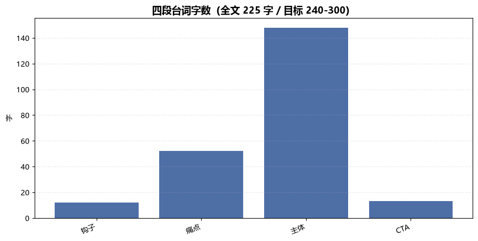
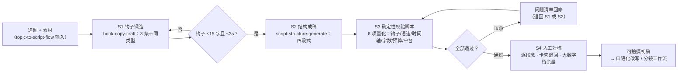

# 选题转脚本 Topic to Script Flow

> 工作流 ｜ 属于「脚本创作师」 ｜ 自媒体创作者客群 ｜ T3 编排型 ｜ 触发：人工（选题确认后）
>
> **把一个选题按固定链路推进到「可拍摄初稿」：钩子锻造 → 四段式成稿 → 确定性校验 → 人工对稿，不跳步、每步落成可检查的表。**
> 3 步编排 + 1 步人工闸门 · 6 项量化校验（钩子/语速/时间轴/字数/预算/平台上限）· 校验脚本实跑（模型不口算）· 一次运行输出 Excel 校验表 + 段落字数分布图
>
> 写作段 2-4h → 15min，按日更计月省约 60h×¥30 ≈ ¥1800


🎬 **[▶ 观看演示视频（在线播放）](https://cdn.jsdelivr.net/gh/bangwozuo/script-writer-zh@main/workflows/topic-to-script-flow/docs/assets/demo.mp4) · [GitHub 页](https://github.com/bangwozuo/script-writer-zh/blob/main/workflows/topic-to-script-flow/docs/assets/demo.mp4)** — 四幕创作叙事：业务钩子 → 真实执行 → 要点到成稿演变 → 交付物

*上图来自真实执行：60s 演示稿校验判定「需微调」——脚本抓出 2 个真问题（CTA 段 1.3 字/秒过稀、全文 225 字低于 240 字下限），产物落盘 Excel + PNG + JSON。*

---

## 链路（三步 + 人工，逐步执行）

### S1 钩子锻造（hook-copy-craft）

输入选题 + 目标人群，输出 **3 条不同类型**钩子候选（悬念/反差/利益/提问/热点借势中至少 3 类），每条满足硬约束：**首句 ≤15 字**（汉字实数，标点不计）、3 秒内出现信息差、正文能兑现。

失败处理：类型不足 3 类（换汤不换药）→ 退回重出；超 15 字 → 精简或退回。

### S2 结构成稿（script-structure-generate）

输入选题素材 + S1 选定钩子 + 目标时长，输出四段式逐段稿（钩子 0-3s / 痛点 3-15s / 主体 15-50s / CTA 50-60s），主体段内部「结论前置-论据-案例-金句」。

失败处理：上游钩子超 15 字或超 3s → **退回 S1，不吸收不妥协**；案例无真实出处 → 标「案例待补」清单，不编造。

### S3 确定性校验（本工作流脚本承担，模型不得口算）

| 检查项 | 标准 | 级别 |
|---|---|---|
| 钩子时长/字数 | ≤3s 且 ≤15 字 | 超标 🔴 退回 S1 |
| 段落语速 | 3.5-6.0 字/秒（>6 念不完；<3.5 掉完播） | 🔴 / 🟡 |
| 时间轴 | 各段连续无重叠，合计 = 目标时长 ±2s | 超差 🔴 |
| 全文字数 | 时长 × 4-5 字（60s = 240-300 字） | 区间外 🔴 |
| 段落预算 | 各段时长 vs 等比预算（60s 基准 3/12/35/10）±10% | 超差 🔴 |
| 平台上限 | 抖音 ≤60s / 小红书 ≤240s / 视频号 ≤60s / B站 ≤600s | 超限 🔴 给重剪方案 |

### S4 人工对稿（不跳过）

逐段念一遍，卡壳处退回 S2 微调；大数字段落留 1-2s 余量；确认后再进下游（口语化改写或分镜）。

## 真实输入 → 真实输出

**输入**（`examples/input.json`）：选题「副业避坑：新人最容易踩的三个坑」/ 60s / 抖音 / 钩子 12 字 / 四段逐段稿（CTA 段刻意偏短以验证检出能力）。

**输出**（脚本实跑，逐段校验）：

| 段落 | 时间轴 | 时长 | 台词字数 | 语速 | 判定 | 说明 |
|---|---|---|---|---|---|---|
| 钩子 | 0-3s | 3s | 12 | 4.00 | ✅ | ≤15 字且 ≤3s |
| 痛点 | 3-15s | 12s | 52 | 4.33 | ✅ | 预算内 |
| 主体 | 15-50s | 35s | 148 | 4.23 | ✅ | 预算内 |
| CTA | 50-60s | 10s | 13 | 1.30 | 🟡 | 过稀（<3.5 掉完播），补 32 字左右 |

**抓出的 2 个真问题**：

1. 🟡 CTA 段 1.3 字/秒过稀——10 秒里 7 秒在静默，是划走高发区。改法（S2 回修）：补互动引导与下期预告至 43 字（4.3 字/秒）
2. 🔴 全文 225 字 < 240 字下限（60s × 4 字）——CTA 补齐后 255 字回到 240-300 区间

**产物**（out/ 实跑落盘）：

| 文件 | 说明 |
|---|---|
| `out/脚本结构校验表.xlsx` | 校验汇总 / 逐段校验（🔴 标红）/ 段落预算 / 平台核对 4 sheet |
| `out/段落字数分布.png` | 四段台词字数柱状图 |
| `out/topic_flow.json` | 机器可读结果（verdict / rows / share / issues） |



*实跑产物：CTA 段字数明显低于其他三段，正是语速过稀问题的可视化。*

## 处理流水线（DAG）



## 快速开始

**方式一：提示词（任意 AI 工具）**

```text
1. 打开 prompt.txt，全文复制
2. 粘贴到 Coze / WorkBuddy / Dify / Claude / ChatGPT
3. 按 schema.json 的输入规格提供：选题 + 时长 + 平台 + 钩子 + 逐段稿
```

**方式二：脚本（校验环节零 AI 依赖，确定性执行）**

```bash
# 演示模式（内置 CTA 过稀的真实缺陷样例）
python scripts/run_flow.py --demo
# 指定输入
python scripts/run_flow.py --input examples/input.json --outdir out
```

「感觉念得完」不是校验——字数实数才是。模型自估字数常差 10% 以上，汉字实数由脚本统计。

## 面向谁 / 什么时候用

| ✅ 该用 | ❌ 别用 |
|---|---|
| 选题确认后快速出可拍摄初稿 | 跳过 S3 校验直接交付（不用模型口算字数语速） |
| 日更账号的脚本流水线主干 | 吸收超标的钩子（15 字红线退回上游，不迁就） |
| 定时/批量多选题成稿 | 编造案例数据（素材缺失标待补清单） |
| 交付前整稿过敏感词预审 | 在 CTA 写虚假承诺（「不涨粉来骂我」） |

## 边界与合规

- 本资产输出为 **AI 辅助生成内容**，发布前整稿须过 `sensitive-word-precheck`，并完成平台 AI 内容标识
- 钩子不承诺正文兑现不了的效果；数据引用注明出处
- 本工作流只到「可拍摄初稿」为止，**不承诺播放量**；对外发布保留人工确认环节
- S4 人工对稿环节不可跳过——模型念不出来的地方，人念得出来

## 文件地图

```text
├── README.md                  ← 本文件
├── SKILL.md                   ← 工作流定义（链路 / 契约 / 边界）
├── prompt.txt                 ← 编排提示词（S1-S4 链路 + 校验标准）
├── schema.json                ← 输入输出契约（机器可读）
├── scripts/run_flow.py        ← S3 确定性校验脚本（6 项量化 → Excel/JSON/PNG）
├── examples/                  ← 真实输入 + 脚本实跑输出
├── docs/                      ← 9 项配套文档（架构 / 流程 / 场景 / 测试报告…）
└── out/                       ← 实跑产物（脚本结构校验表.xlsx / 段落字数分布.png / topic_flow.json）
```

---

*本资产遵循 [bangwozuo 数字员工资产规范](https://github.com/bangwozuo/digital-employee-spec) v3.0 ｜ [所属员工：脚本创作师](../../) ｜ [总入口](https://github.com/bangwozuo/digital-employees-hub-zh)*
