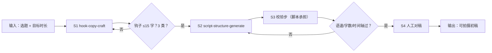

# 选题转脚本

把选题推进到「可拍摄初稿」：钩子 → 四段式成稿 → 确定性校验 → 人工对稿。

## 元信息

| 字段 | 值 |
|------|-----|
| ID | `de_media_02_wf01` |
| 类型 | **`composite`（复合技能）** |
| 所属员工 | 脚本创作师 |
| 阶段 | `P0` |
| 复杂度 | `S` |
| 触发方式 | 人工（选题确认后） |
| ROI | 写作段 2-4h→15min，按日更计月省约 60h |
| 资产形态 | 提示词编排 + Python 校验脚本 |

## 能力描述

1. **S1 钩子锻造**：3 条不同类型候选（悬念/反差/利益/提问/热点借势），
   首句 ≤15 字、3 秒信息差、可兑现
2. **S2 结构成稿**：四段式（钩子 0-3s / 痛点 3-15s / 主体 15-50s / CTA 50-60s），
   主体段「结论前置-论据-案例-金句」；无出处案例标「待补」不编造
3. **S3 确定性校验**（脚本承担）：段落语速 3.5-6.0 字/秒双死线、时间轴 ±2s、
   全文 = 时长 × 4-5 字、段落预算 ±10%（60s 基准 3/12/35/10）、平台上限
   （抖音 ≤60s / 小红书 ≤240s / 视频号 ≤60s / B站 ≤600s）
4. **S4 人工对稿**：逐段念一遍，大数字留 1-2s，卡壳退回 S2

## 编排的原子技能

| # | 原子技能 | 能力 |
|---|---------|------|
| 1 | [钩子文案锻造](../../skills/hook-copy-craft/) | 黄金 3 秒钩子候选（五类型公式） |
| 2 | [脚本结构生成](../../skills/script-structure-generate/) | 四段式成稿 + 字数配平 |

## 步骤链路（DAG）



## 步骤明细

| # | 步骤 | 技能资产 | 输入 | 输出 | 失败处理 |
|---|------|---------|------|------|---------|
| 1 | 钩子锻造 | `hook-copy-craft` | 选题 + 人群 | 3 条不同类型钩子 | 类型不足/超 15 字退回重出 |
| 2 | 结构成稿 | `script-structure-generate` | 素材 + 定稿钩子 + 时长 | 四段式逐段稿 | 钩子超标退回 S1；案例无出处标待补 |
| 3 | 确定性校验 | 本流脚本 | segments + duration_s + platform | 逐段校验 + 问题清单 | segments 为空中止；🔴 优先改 |
| 4 | 人工对稿 | （人工） | 校验表 | 定稿 | 卡壳处退回 S2 微调 |

## 输入规格

| 字段 | 类型 | 必填 | 说明 |
|------|------|------|------|
| `topic` | string | ✅ | 选题与真实素材 |
| `duration_s` | number | ✅ | 目标成片时长（30/45/60/90） |
| `platform` | string | ⬜ | 抖音/小红书/视频号/B站，默认抖音 |
| `hook` | string | ⬜ | 已定稿钩子（跳过 S1 时传入） |
| `segments` | array | ✅ | S2 产出：`{seg, dur_s, line}`，seg ∈ 钩子/痛点/主体/CTA |

## 输出规格

| 字段 | 类型 | 说明 |
|------|------|------|
| `verdict` | string | 通过 / 需微调 / 打回重改 |
| `rows` | array | 逐段校验（时间轴/字数/语速/判定） |
| `share` | array | 段落时长 vs 等比预算 |
| 产物 | file | `out/脚本结构校验表.xlsx`、`out/段落字数分布.png`、`out/topic_flow.json` |

## 错误处理

| 情况 | 处理方式 |
|------|---------|
| segments 为空 | 中止，索要四段式逐段稿 |
| 语速 >6.0 字/秒 | 🔴 给出删字数（如「删约 8 字」） |
| 语速 <3.5 字/秒 | 🟡 给出补字数（掉完播区间） |
| 时间轴 ≠ 目标 ±2s | 列出超差秒数 |
| 钩子 >15 字 / >3s | 🔴 退回 hook-copy-craft |
| 全文字数在区间外 | 🔴 提示 60s = 240-300 字口径 |
| 超平台上限 | 给重剪方案（抖音超 60s 需中视频计划） |

## 使用步骤

### 方式一：纯提示词编排（跨平台）

1. 把 `prompt.txt` 全文粘贴为系统提示词
2. 提供选题、时长、平台与素材
3. 按 S1→S2→S3→S4 得到定稿初稿
4. S3 的数值用下方脚本实测，不靠模型口算

### 方式二：带脚本（端到端产物）

```bash
python <WF_DIR>/scripts/run_flow.py --input input.json --outdir out
python <WF_DIR>/scripts/run_flow.py --demo
```

| 平台 | 编排方式 |
|------|---------|
| **Coze / 扣子** | 工作流节点填 S1/S2 技能 prompt.txt，S3 用代码节点跑校验脚本 |
| **Dify** | Workflow → LLM 节点链 + 代码节点 |
| **WorkBuddy** | 新建 Skill 按 prompt.txt 步骤串联 |

## 边界（不做的事）

- ❌ 不跳过校验交付——「感觉念得完」不算校验
- ❌ 不用模型口算字数语速——以脚本汉字实数为准
- ❌ 不吸收超标钩子——15 字红线退回上游
- ❌ 不编造案例数据——标待补清单
- ❌ 不跳过人工对稿

## 调用示例

**输入**（`examples/input.json`）：选题「副业避坑」/ 60s / 抖音 / 钩子 12 字 /
四段逐段稿（CTA 段过稀）。

**输出**（脚本实跑）：合计 60s / 225 字，抓出 2 个真问题——CTA 段 1.3 字/秒
过稀（🟡 补 32 字）、全文 225 字 < 240 字下限（🔴）→ **需微调**。
逐段校验、段落预算、平台核对三表落 Excel，段落字数分布出图。

## 所属工作流

本资产为复合技能（工作流），是独立的端到端流程；下游可接
`voiceover-colloquial-flow`（口语化）与 `storyboard-shotlist-flow`（分镜）。

## 合规声明

- 输出标注「AI 生成内容」；发布前整稿过 `sensitive-word-precheck`
- 钩子不承诺兑现不了的效果；数据注明出处
- 对外发布保留人工确认环节；只到「可拍摄初稿」为止

---

*本复合技能遵循 [bangwozuo 数字员工资产规范](https://github.com/bangwozuo/digital-employee-spec) v3.0*
