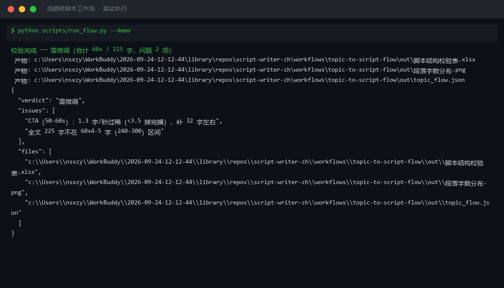

# 截图与录屏

> 以下素材均来自**真实执行**：`--run` 实拍终端 / 实跑产物文件，无摆拍。

## 演示视频


*第二帧为实跑产物图表*

## 执行截图



## 实跑产物

| 文件 | 说明 |
|---|---|
| [`out/topic_flow.json`](out/topic_flow.json) | 结构化结果（实跑生成） · 2 KB |
| [`out/段落字数分布.png`](out/段落字数分布.png) | 图表产物（实跑生成） · 26 KB |
| [`out/脚本结构校验表.xlsx`](out/脚本结构校验表.xlsx) | Excel 工作簿（实跑生成） · 8 KB |


---

## 附录：实跑输出明细

> 本资产为纯提示词客户端资产，无界面可截图。以下为**实跑运行效果**。

## 运行效果

### 输入

```json
{
  "input": "请提供工作流的初始输入数据"
}

```

### 输出

## 执行摘要

本次执行因初始输入为占位符，无法完成端到端的选题转脚本流程，已给出步骤说明与所需补充信息。

## 分步结果

1. 步骤 1（脚本结构生成）：输入缺失选题主题与素材，无法按钩子-痛点-论证-转化模板成稿。
2. 步骤 2（钩子文案锻造）：上一步输出不完整，无法生成黄金 3 秒开场钩子变体。

## 最终交付物

当前无可直接使用的最终输出。请补充以下信息后重新执行：

- **选题主题**：需要转化为脚本的核心内容或素材描述。
- **时长**（可选）：成片目标时长（如 60 秒）。
- **投放平台**（可选）：如小红书、抖音等，用于适配钩子风格与平台调性。

补充后，本工作流将依次输出结构化脚本与多条黄金 3 秒钩子候选。

*AI 生成内容*

---

*运行效果由实跑验证生成*
