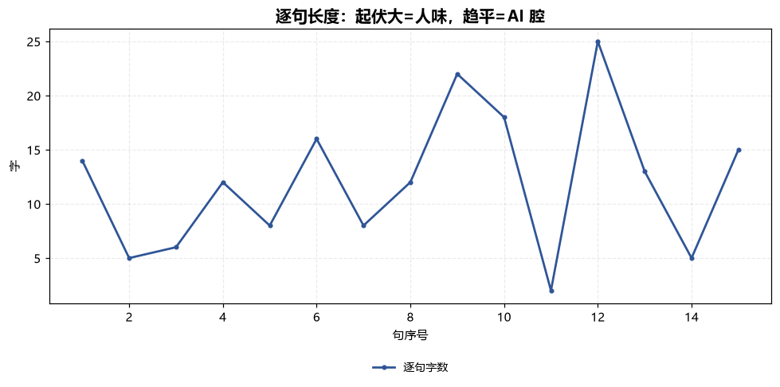
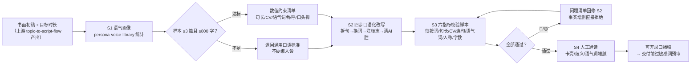

# 口播稿口语化改写 Voiceover Colloquial Flow

> 工作流 ｜ 属于「脚本创作师」 ｜ 自媒体创作者客群 ｜ T3 编排型 ｜ 触发：事件（选题转脚本工作流后自动）
>
> **把书面稿推进到「带人味、可开录的口播稿」：语气画像约束 → 四步口语化改写 → 六指标脚本校验 → 人工通读。**
> 3 步编排 + 1 步人工闸门 · 六指标量化校验（衔接词/句长/CV/均长连句/语气词/人称）· 画像约束优先（防「号被盗了」）· 一次运行输出 Excel 校验表 + 句长分布图


*上图来自真实执行：181 字改写稿校验判定「打回重改」——六指标中 5 项 ✅，脚本抓出 1 项 🔴（总字数 181 < 240 字下限，60s 成片会留白 20 秒），产物落盘 Excel + PNG + JSON。*

---

## 链路（三步 + 人工，逐步执行）

### S1 语气画像（persona-voice-library）

输入创作者 ≥3 篇历史稿件（合计 ≥800 字），输出数值化改写约束：

| 约束项 | 目标 |
|---|---|
| 平均句长目标 | 样本均值 ±2 字 |
| 句长 CV 下限 | ≥0.5 |
| 语气词密度区间 | 2-4 个/百字内按样本定 |
| 高频人称称呼 | 按样本沿用，不得混用 |
| 口头禅清单 | 每篇 ≤4 次，须人工确认 |

失败处理：样本不足 → 输出「样本不足清单」索要稿件，退回通用口语标准（**画像缺位时不硬编人设**）。

### S2 口语化改写（colloquial-rewrite，四步执行）

1. **拆长句**：单句压到 8-14 字，超 25 字必拆；连续 3 句同长 >18 字判 AI 腔必打散
2. **换书面词**：进行/予以/之/其/亦/均 → 直接动词与白话；同音歧义词重写
3. **注入口语标志**：「你」≥10 个/千字、语气词 2-4 个/百字、每 3-5 句一个 ≤6 字呼吸口、数字口语化（3.2 万元 → 三万二）
4. **清 AI 腔**：衔接词密度 <1 个/千字；完美三段式改结论前置；抽象词换具体动作+数字

失败处理：改写导致事实增删 → 拒绝该处改动；字数骤降 >30% → 触发信息点取舍清单交人工决断，不硬砍。

### S3 六指标校验（本工作流脚本承担，模型不得口算）

| 指标 | 目标 | 级别 |
|---|---|---|
| 衔接词密度 | <1 个/千字 | >3 🔴；1-3 🟡 |
| 平均句长 | 8-14 字（画像优先） | 区间外 🟡 |
| 句长变异系数 CV | ≥0.5 | <0.4 🔴；0.4-0.5 🟡 |
| 均长连句 | 连续 3 句同长 >18 字 = 0 组 | 有 🔴 |
| 语气词密度 | 2-4 个/百字 | 区间外 🟡（>4 油腻比生硬更掉粉） |
| 第二人称密度 | ≥10 个/千字 | 不足 🟡 |
| 总字数 vs 时长 | 时长 × 4-5 字（60s = 240-300） | 区间外 🔴 |

### S4 人工通读（不跳过）

逐句念一遍：卡壳处退回 S2；「你/咱们」念着别扭的地方检查语境；确认语气词没有堆腻（>4 个/百字的稿念一遍自己就会想删）。

## 真实输入 → 真实输出

**输入**（`examples/input.json`）：口语化改写稿 181 字 / 15 句，target_duration_s = 60，含画像约束（句长 8-12 字、语气词 2-4 个/百字、口头禅 ≤4 次/篇）。

**输出**（脚本实跑，六指标校验）：

| 指标 | 目标 | 实测 | 判定 |
|---|---|---|---|
| 衔接词密度 | <1 个/千字 | 0.0（0 处） | ✅ |
| 平均句长 | 8-14 字 | 12.1 字 | ✅ |
| 句长变异系数 CV | ≥0.5 | 0.52 | ✅ |
| 均长连句 | 0 组 | 0 组 | ✅ |
| 语气词密度 | 2-4 个/百字 | 2.2（4 个） | ✅ |
| 第二人称密度 | ≥10 个/千字 | 16.6（3 处） | ✅ |
| 总字数 vs 时长 | 240-300 字 | 181 字 | 🔴 缺 59 字 |

**抓出的真问题**：按 4.5 字/秒只够念 40 秒，当 60s 稿交付会在最后 20 秒留白。补字方案：「会做表的/会剪视频的」各补一个具体案例句（约 30 字），CTA 前补收益预期管理句（约 30 字），补完重跑脚本复检。

**产物**（out/ 实跑落盘）：

| 文件 | 说明 |
|---|---|
| `out/口语化校验表.xlsx` | 六指标汇总 / 句段明细（>18 字标红）2 sheet |
| `out/句长分布.png` | 逐句长度折线（2-25 字起伏形态可见） |
| `out/colloquial_flow.json` | 机器可读结果（verdict / rows / issues） |



*实跑产物：句长 2-25 字起伏交错，CV 0.52 达标的「呼吸感」形态。*

## 处理流水线（DAG）



## 快速开始

**方式一：提示词（任意 AI 工具）**

```text
1. 打开 prompt.txt，全文复制
2. 粘贴到 Coze / WorkBuddy / Dify / Claude / ChatGPT
3. 按 schema.json 的输入规格提供：改写稿 + 目标时长 + 画像约束（若有）
```

**方式二：脚本（校验环节零 AI 依赖，确定性执行）**

```bash
# 演示模式（内置字数不足的真实缺陷样例）
python scripts/run_flow.py --demo
# 指定输入
python scripts/run_flow.py --input examples/input.json --outdir out
```

模型自估句长语速常差 10% 以上——以脚本汉字实数为准，不要自己算。

## 面向谁 / 什么时候用

| ✅ 该用 | ❌ 别用 |
|---|---|
| 选题转脚本工作流后的自动口语化环节 | 跳过 S1 直接改（没有画像 = 「通用口语」，观众感觉号被盗了） |
| 有历史稿件样本时做「像本人」的定向改写 | 增删事实（改动前后事实清单必须一致） |
| 校验数值以脚本实跑为准的交付流程 | 语气词堆到 >4 个/百字（油腻比生硬更掉粉） |
| 同音歧义词重写（全部/全不、期中/其中） | 把违禁词当风格改写（合规归 sensitive-word-precheck，不豁免） |

## 边界与合规

- 本资产输出为 **AI 辅助生成内容**，发布前整稿须过 `sensitive-word-precheck`，并完成平台 AI 内容标识
- 语气画像仅用于该创作者本人，**样本不跨账号复用**
- 对外发布保留人工确认环节；本工作流只到「可开录」为止，不含拍摄剪辑
- 数据与引用原样保留，不为口语化牺牲可溯源标注

## 文件地图

```text
├── README.md                  ← 本文件
├── SKILL.md                   ← 工作流定义（链路 / 契约 / 边界）
├── prompt.txt                 ← 编排提示词（S1-S4 链路 + 六指标标准）
├── schema.json                ← 输入输出契约（机器可读）
├── scripts/run_flow.py        ← S3 确定性校验脚本（六指标 → Excel/JSON/PNG）
├── examples/                  ← 真实输入 + 脚本实跑输出
├── docs/                      ← 9 项配套文档（架构 / 流程 / 场景 / 测试报告…）
└── out/                       ← 实跑产物（口语化校验表.xlsx / 句长分布.png / colloquial_flow.json）
```

---

*本资产遵循 [bangwozuo 数字员工资产规范](https://github.com/bangwozuo/digital-employee-spec) v3.0 ｜ [所属员工：脚本创作师](../../) ｜ [总入口](https://github.com/bangwozuo/digital-employees-hub-zh)*
