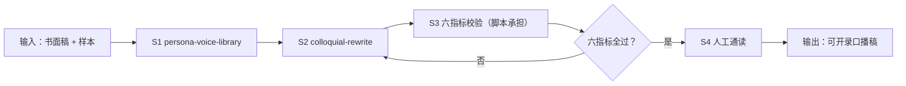

# 口播稿口语化改写

把书面稿推进到「带人味、可开录的口播稿」：画像 → 改写 → 六指标校验 → 人工通读。

## 元信息

| 字段 | 值 |
|------|-----|
| ID | `de_media_02_wf02` |
| 类型 | **`composite`（复合技能）** |
| 所属员工 | 脚本创作师 |
| 阶段 | `P0` |
| 复杂度 | `S` |
| 触发方式 | 事件（WF1 选题转脚本后自动） |
| ROI | 口播稿返工率降一半：念着别扭的稿拍完再改 = 重录 2 小时 |
| 资产形态 | 提示词编排 + Python 校验脚本 |

## 能力描述

1. **S1 语气画像**：样本统计出数值约束（句长目标/CV/语气词区间/称呼/口头禅
   ≤4 次每篇），样本不足就索要，不硬编人设
2. **S2 四步改写**：拆长句（8-14 字，连续 3 句同长 >18 字判 AI 腔）→ 换书面词
   （进行/予以/之/其 → 白话；同音歧义重写）→ 注入口语标志（第二人称 ≥10 个/千字、
   语气词 2-4 个/百字、短句呼吸口）→ 清 AI 腔（衔接词 <1 个/千字、三段式改结论前置）
3. **S3 六指标校验**（脚本承担）：衔接词 / 平均句长 / CV / 均长连句 / 语气词 /
   第二人称 + 总字数 vs 时长（60s = 240-300 字），全部以脚本汉字实数为准
4. **S4 人工通读**：念一遍卡壳处退回 S2

## 编排的原子技能

| # | 原子技能 | 能力 |
|---|---------|------|
| 1 | [人设语气库](../../skills/persona-voice-library/) | 样本统计语气画像与改写约束 |
| 2 | [口语化改写](../../skills/colloquial-rewrite/) | 四步口语化改写 |

## 步骤链路（DAG）



## 步骤明细

| # | 步骤 | 技能资产 | 输入 | 输出 | 失败处理 |
|---|------|---------|------|------|---------|
| 1 | 语气画像 | `persona-voice-library` | ≥3 篇历史稿件 | 数值化改写约束 | 样本不足输出清单，降级为通用标准 |
| 2 | 口语化改写 | `colloquial-rewrite` | 书面稿 + 约束 + 时长 | 改写稿 + 改动对照 | 事实增删拒绝；字数骤降 >30% 交取舍清单 |
| 3 | 六指标校验 | 本流脚本 | 改写稿 + target_duration_s | 六指标 + 问题清单 | 文稿 <50 字中止；🔴 优先改 |
| 4 | 人工通读 | （人工） | 改写稿 + 校验表 | 定稿 | 卡壳处退回 S2 |

## 输入规格

| 字段 | 类型 | 必填 | 说明 |
|------|------|------|------|
| `text` | string | ✅ | 待改写文稿（≥50 字） |
| `target_duration_s` | number | ⬜ | 目标成片时长（核总字数用） |
| `profile` | object | ⬜ | S1 画像约束（avg_sentence_target/tone_range/catchphrase_max） |

## 输出规格

| 字段 | 类型 | 说明 |
|------|------|------|
| `verdict` | string | 通过 / 需微调 / 打回重改 |
| `rows` | array | 六指标校验（目标/实测/判定/说明） |
| `issues` | array | 按级别排序的问题清单 |
| 产物 | file | `out/口语化校验表.xlsx`、`out/句长分布.png`、`out/colloquial_flow.json` |

## 错误处理

| 情况 | 处理方式 |
|------|---------|
| 文稿 <50 字 | 中止索要完整稿 |
| 衔接词 >3 个/千字 | 🔴 AI 腔，逐个删除或换语气词 |
| CV <0.4 | 🔴 句长严重趋平，插 ≤6 字短句呼吸口 |
| 语气词 >4 个/百字 | 🟡 偏油腻，删减 |
| 总字数在区间外 | 🔴 给补/删字数 |
| 字数骤降 >30% | 交信息点取舍清单，人工决断 |

## 使用步骤

### 方式一：纯提示词编排（跨平台）

1. 把 `prompt.txt` 全文粘贴为系统提示词
2. 提供书面稿 +（可选）历史稿件样本与目标时长
3. 按 S1→S2→S3→S4 得到可开录稿
4. S3 数值用下方脚本实测

### 方式二：带脚本（端到端产物）

```bash
python <WF_DIR>/scripts/run_flow.py --input input.json --outdir out
python <WF_DIR>/scripts/run_flow.py --demo
```

| 平台 | 编排方式 |
|------|---------|
| **Coze / 扣子** | S1/S2 节点填技能 prompt.txt，S3 用代码节点跑校验脚本 |
| **Dify** | Workflow → LLM 节点链 + 代码节点 |
| **WorkBuddy** | 新建 Skill 按 prompt.txt 步骤串联 |

## 边界（不做的事）

- ❌ 不跳过画像直接改——通用口语 ≠ 个人风格
- ❌ 不跳过校验——模型口算常差 10% 以上
- ❌ 不增删事实——数据与引用原样保留
- ❌ 不制造同音歧义
- ❌ 语气词不超 4 个/百字
- ❌ 合规不豁免——发布前过 sensitive-word-precheck

## 调用示例

**输入**（`examples/input.json`）：改写稿 181 字 / 15 句，target 60s，含画像约束。

**输出**（脚本实跑）：六指标 6 项 ✅（衔接词 0、平均句长 12.1、CV 0.52、均长连句
0 组、语气词 2.2/百字、第二人称 16.6/千字）+ 1 项 🔴——总字数 181 < 240 字下限
（60s），判「打回重改」需补 59 字。句段明细与句长分布同步落盘。

## 所属工作流

本资产为复合技能（工作流），上游为 `topic-to-script-flow`（选题转脚本），
下游过 `sensitive-word-precheck` 后进入发布流程。

## 合规声明

- 输出标注「AI 生成内容」；发布前整稿过敏感词预审
- 语气画像仅用于创作者本人，样本不跨账号复用
- 对外发布保留人工确认环节

---

*本复合技能遵循 [bangwozuo 数字员工资产规范](https://github.com/bangwozuo/digital-employee-spec) v3.0*
