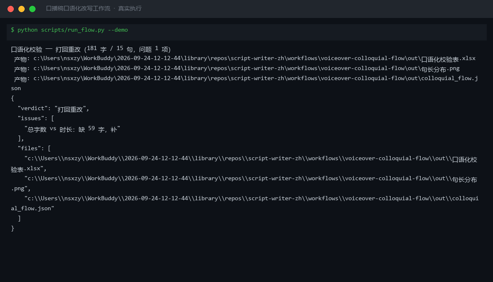

# 截图与录屏

> 以下素材均来自**真实执行**：`--run` 实拍终端 / 实跑产物文件，无摆拍。

## 演示视频


*第二帧为实跑产物图表*

## 执行截图



## 实跑产物

| 文件 | 说明 |
|---|---|
| [`out/colloquial_flow.json`](out/colloquial_flow.json) | 结构化结果（实跑生成） · 2 KB |
| [`out/口语化校验表.xlsx`](out/口语化校验表.xlsx) | Excel 工作簿（实跑生成） · 7 KB |
| [`out/句长分布.png`](out/句长分布.png) | 图表产物（实跑生成） · 50 KB |


---

## 附录：实跑输出明细

> 本资产为纯提示词客户端资产，无界面可截图。以下为**实跑运行效果**。

## 运行效果

### 输入

```json
{
  "input": "请提供工作流的初始输入数据"
}

```

### 输出

## 执行摘要

本次执行因初始输入为占位符，无法完成端到端的口播稿口语化改写流程，已给出步骤说明与所需补充信息。

## 分步结果

1. 步骤 1（口语化改写）：输入缺失待改写的书面初稿，无法执行逐段改写与改动说明。
2. 步骤 2（人设语气库）：上一步输出不完整，无法对改写结果进行语气聚类与人设归纳。

## 最终交付物

当前无可直接使用的最终输出。请补充以下信息后重新执行：

- **书面初稿**：需要改写成口播风格的原始文本。
- **目标平台/风格**（可选）：如小红书、抖音等，用于调整语气词与断句节奏。
- **人设参考**（可选）：已有语气样本或人格关键词，便于第二步精准聚类。

补充后，本工作流将依次输出口语化改写稿与人设语气库归纳结果。

*AI 生成内容*

---

*运行效果由实跑验证生成*
